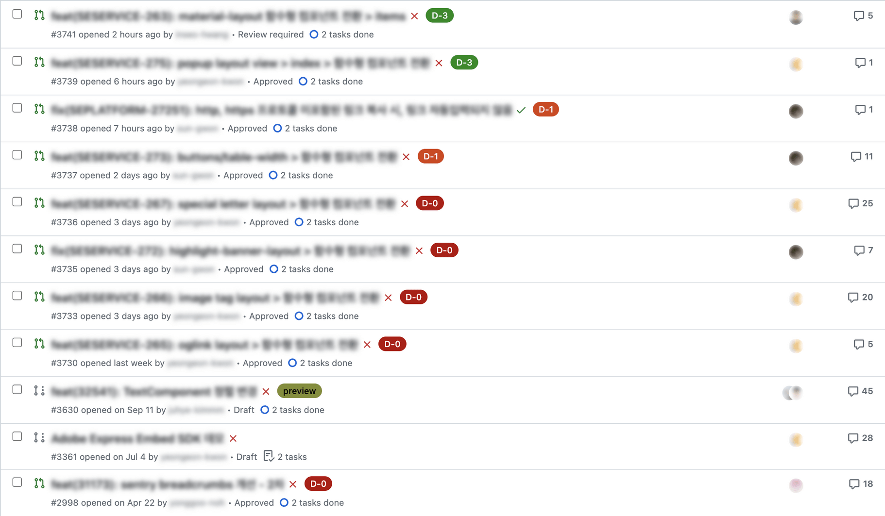

# CI/CD란

CI(`Continues Intergration`)과 CD(`Continues Delivery`)라는 용어는 개발을 하다보면 왠하면 듣게 될것이다.

이를 직역하자면 지속성 통합과 지속적 배달이라고 해석할 수 있겠다.

또한 일부에서는 CD를 `Continuous Deployment`라고 확장하기도 한다.

단어가 갑자기 어려워진거 같지만 요는 원시 코드가 프로덕션까지 가는 여정과 이를 지속하는 것을 고급지게 부르는 말이다.
# 🔍 어원

1991년 Grady Booch에 의해서 처음 사용되었다고 알려진다. 이후 `Extreme programming`(XP)에서 본격적으로 정의되고 사용되었다고 한다.

# 🔑 Key Point

<!-- XP에서는 `Collective Code Ownership`에서 왜 CI가 필요한지를 설명한다. -->

 

    
    
http://www.extremeprogramming.org/rules/integrateoften.html

     

 

XP에서는 개발자는 가능한 주기적으로 코드 저장소에 커밋해야한다고 한다.

이는 코드 병합을 미룸으로서 발생할 수 있는 다양한 문제, 호환성 문제와 같은 여러 문제를 피하기 위해서라고 한다.

원인은 여러가지가 있겠지만 코드 병합을 미룸으로서 오는 사이드 이펙트는 비용의 발생이며 이러한 부분도 충분히 예방할 수 있다는게 XP에서의 설명이다.

당연하겠지만 해당 이유를 통한 비용 지불은 굉장히 소모적이고 피곤한 일이다.

 

이와 함께 등장하는 단어가 `Sequential Integration`(순차적 통합)이다.

XP에서는 개발자가 코드를 병렬적으로 통합하는 일은 대부분 확인을 하지 않거나 단순한 믿음을 통해서 발생한다고 한다.

이렇게 병합된 코드는 당연히 검증되지 않은 상태에서 벌어진다.

테스트 되지 않은 코드는 미시적으로도 문제가 발생할 수도 있다.

따라서 빈번하게 테스트하고 코드를 통합하는 것이 순차적 통합의 내용이라고 할 수 있다.

 

그리고 주요 개념으로서 `Collective Code Ownership`(집단적 코드 소유)를 이야기한다.

여기서는 모든 개발자가 어떠한 세그먼트에 대해서든 아이디어/버그/리팩토링을 위해서 코드를 변경할 수 있도록 장려하는 개념이다.

대부분의 아키텍처는 수석/리드 프로그래머 아키텍트의 의해서 아키텍처가 결정될 것이고 아키텍처에 대한 사항을 단 한명 혹은 소수의 사람이 가지고 있을 것이다.

이는 잘못된 패턴은 아니지만 좋든 싫든 이미 아키텍처에 대한 디자인은 팀의 전반적으로 분산되어 있더고 한다.

개발자가 커밋을 하면서 알게 모르게 아키텍처에 관여한다고도 할 수 있다.

 

그렇다면 누구든 디자인 패턴을 변경해야 한다면 리드/수석 아키텍트에게 검증 혹은 권한을 받아야 하는가? 라고 하기에는 복잡한 문제가 된다.

    
    
자동화된 개발프로세스

     

 

그렇기에 XP에서는 단위테스트를 통해 이를 해결하고자 한다.

자동화된 단위 테스트는 릴리스로 넘어가기 통과를 목표로 한다면 `Continues Intergration`를 통해 시험된다. 

해당 CI가 정상적으로 기능한다면 누구나 클래스의 모든 메서드에 접근하고 수정할 수 있다. 

이는 소수의 인원의 감독하에 관리되는것보다 공동의 책임을 통해 관리하는 것이 더 신뢰가 가능하다고 한다.

보다 현실적인 이유는 프로젝트에 인원이 주기적으로 변경되기에 오히려 집단 소유권이 더 현실적인 이유가 될 수 있다.

## 요약

CI(지속적 통합)이 나오게 된 이유는 집단적 코드 소유에 대한 실현으로 단위 테스트 및 코드 저장소에 합치기 위해 사용한다.

# 📜 개발 방법론

XP에서 CI를 다루는 가장 중요한 요소는 아키텍처와 Unit Test를 통해 소스 코드를 어떻게 코드 저장소로 병합할 것인지를 가장 중요하게 여기고 있다.

이는 aws가 ci/cd에 대한 보고서를 작성하면서 ci/cd를 어떻게 구성해야하는지 등에 작성한 보고서 또한 존재한다.

해당 보고서에서는 GitFlow와 TrunkBased방식의 개발 방법론에 ci/cd에 대해서 작성되어있다.

1. GitFlow

2. TrunkBased

 
 

위 두가지 방법 모두 Git에 대하여 접근은 다르지만 공통적으로 통합 테스트가 단계마다 들어간다는 것을 알 수 있다.

# CI 극장

`ThoughtWorks` 기술 레이더는 최근 기술 팀 안티 패턴인 "CI 극장"을 피할 것을 권고했다.

그와 동시에 CI 극장이라는 단어 또한 사용하였는데 이는 실제로 실행하지는 않지만 지속적인 통합을 실행한다고 착가하는 행위를 뜻한다.

마치 CI 서버가 있으니 CI가 실행되었다고 믿는, 마치 극장을 보는것과 같다고 하여 저런 말이 탄생하였다.

# CI 안티패턴

이러한 CI 극장을 만드는데에 여러가지 요소가 있는데 아래와 같다.

1. 수명이 긴 branch를 사용하고 정기적으로 master(main)에 merge하지 않는다.

    * 아래 그림은 Main에서 파생된 Green과 Plum 브런치가 굉장히 길게 살아있으며, 어느 순간에 Main으로 Merge를 하는 예시이다.

    * 이렇게 진행된다면 커밋의 양이 많기에 통합에 있어 애로사항을 겪는다.

    
2. 낮은 테스트 커버리지에 대해 빌드를 수행한다.

    * 이러한 테스트는 아이러니하게도 빌드 시간의 확대로 이어지며, 지속된다면 개발자는 오히려 긴 시간을 피하기 위해 여러 커밋을 한번에 체크 인하는 케이스가 발생한다.

3. 오랜 기간 빌드가 실패하는 것을 방치한다.

    * 빌드가 실패할수도 있다. 그렇지만 이를 방치한다는건 후속을 체크인에 대해 더 많은 장애 및 종속성 해결에 자원을 사용한다는 의미이다.

# 결론

많은 사람과 저를 비롯해서 생각하길 CI/CD는 단순히 빌드와 테스트를 거쳐 코드를 통합 혹은 배포하는 것이라고 생각을 했지만 다른 사람이 이야기하는 지속에 있어서는 조금 다르다고 합니다.

바로 코드가 Main에 잘 통합이 되는가입니다.

대부분의 SWE나 CTO가 말하길 팀원 사정, 현지의 상황에 맞게 조율을 하겠지만 대부분의 경우는 `테스트` 와 `코드 리뷰`를 통해 버그를 해결 할 수 있도록 프로세스를 통합이라고 이야기합니다.

예를 들면 힐링페이퍼의 경우 PR을 열었을때 커밋이 3개가 넘어가거나 코드가 200줄이 넘는 경우 bot이 경고를 한다고 한다.

따라서 어플리케이션을 잘 배포하는 것 또한 중요하지만 그에 못지 않게 잘 병합하는 것 또한 중요하다고 할 수 있습니다.

 

지금까지 자료를 조사해오면서 공통적으로 느꼈던 부분은 한가지가 있다.

이는 CI/CD가 단순히 코드를 배포하는 것이 아닌 개발론에 더 가깝다는 것이다.

어찌보면 단어 자체가 개발론에서 출발하였으니 당연한 수순일지도 모른다.

# 제안점

개인적으로는 어떤 것이 가장 좋은 CI툴이라고 할 수는 없지만 접근성이 좋은 것이 최선이라고 생각한다.

가령 VCS와 잘 통합되어 움직이는 `Github Action`이나 `Gitlab Runner`가 좋은 선택이라고 생각된다.

해당 툴들은 따로 봇과 같이 추가를 하지 않더라도 Web UI에서 진행 사항을 확인할 수 있으며, 이는 PR에서 `Mergeable`을 수행할 수 있는 파이프라인을 확인 가능하기 때문이다.

아래는 Naver에서 소개하는 GitHub Actions를 이용한 코드 리뷰 문화 개선에 대한 글에서 발췌한 내용이다.

해당 게시글에서는 Reminder를 도입하여 PR에 리뷰가 얼마나 잘 되는지를 확인한 글이지만 Github Action을 통해 해당 기능을 구현하였다.

또한 Tag와 인디케이터를 통해 최소한의 테스트를 거쳤는지 등을 확인할 수 있었다.

이러한 접근 방식은 앞서 얘기했던 `Trunk-based`나 `github-flow`와 같은 개발론과 같이 사용하기도 좋다고 생각된다.

<!-- # 구성도 -->
<!-- 
그렇다면 현실적인 개발자가 마주하게될 환경은 아래와 같을 것이다.

정확하게는 CI/CD뿐만이 아닌 전체 서비스에 대하여라고 볼 수 있다.

    
    
bytebytego

     

  -->
