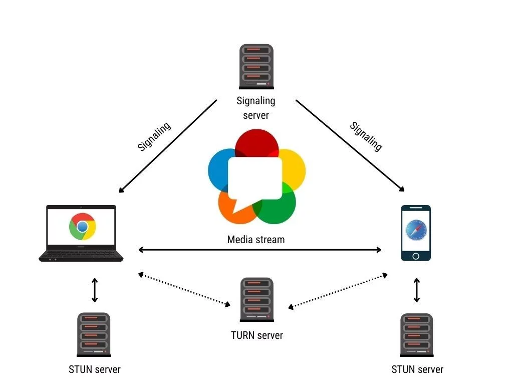
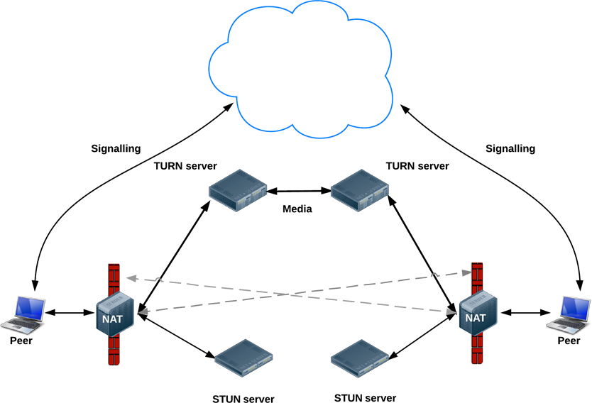
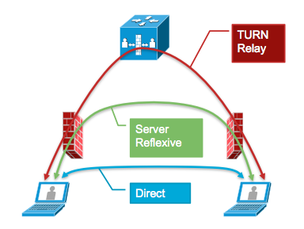
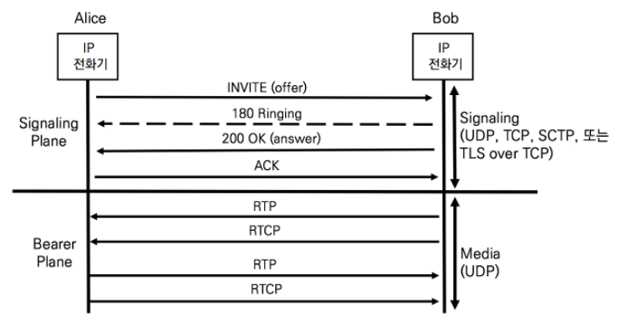
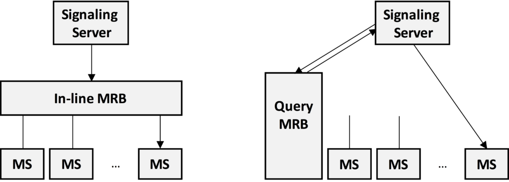

# STUNner를 이용하여 K8S에서 webRTC 서빙

WebRTC란 `Web Real-Time Communications`의 약자로 웹 어플리케이션에서 실시간으로 미디어를 주고 받기 위해 사용되는 프로토콜이다.

그림을 보면 각각의 클라이언트끼리 연결되어 있는 것을 확인할 수 있다.

즉, 서버를 거치지 않고 p2p 기반으로 통신을 하게 된다.

WebRTC를 구성하는 기술은 정말 많지만 가장 중요한 클래스는 다음 3가지라고 할 수 있다.

* MediaStream

* RTCPeerConnection

* RTCDataChannel

위 3가지의 클래스를 통해 데이터가 교환되며 이러한 과정을 시그널링(Signaling)이라고 한다.

# 어떻게 직접 통신을 하는가?

P2P라고는 했지만 Web에서 각자의 IP를 얻어내기 위해서는 제 3자가 필요하게 된다.

직접 연결을 원하는 두 클라이언트를 A, B라고 했을때 A와 B가 3자에게 자신의 IP를 알아내고 연결이 수립이 된다. 이를 ICE(`Interactive Connectivity Establishment`)라고 한다.

이러한 ICE의 주요 목표는 두 피어간의 네트워크 경로 중 최적의 연결을 설정하는 것을 의미한다. 이때 여러 후보(Candidate)를 탐색하고 연결가능한 경로를 설정한다.

### STUN과 TURN 서버
----
 

앞에서 ICE수립을 위해 두 피어의 네트워크 경로를 찾는다고 하였는데 이때 쓰이는 것이 STUN서버이다.

STUN은 `Session Traversal Utilities for NAT`이라고 하며 자신의 공인 IP와 Port를 확인할때 사용된다.

그런데 만약 네트워크 정책등의 이유로 직접 통신이 불가능할 경우 이때 TURN서버가 사용된다.

TURN은 `Traversal Using Relays around NAT`이다.

TURN서버가 동작할때의 그림은 위와 같다.

피어간의 직접 통신이 불가능할때 릴레이 서버로서 이용된다고 할 수 있다.

 

### Candidate
----
 

ICE프레임워크에서는 Candidate를 위의 그림과 같이 분류한다.

* Direct Candidate

* Server Reflexive Candidate : Nat장비가 가지는 클라이언트의 공인 IP

* TURN relay Candidate

이때 직접 연결을 하게 되는 Candidate는 `Direct Candidate`와 `Server Reflexive Candidate`이다.

 

### SDP
----
 

ICE프레임워크를 통해 피어간의 정보를 찾았고 통신을 위한 프로토콜이 SDP라고 한다.

SDP는 `Session Description Protocol`의 약자이다.

SDP는 두 가지 응답 모델 Answer와 Offer를 가지며 이것을 통해 상대방과의 비디오 해상도, 오디오 등의 여부를 확인한다.

해당 프로토콜은 IETF의 RFC 4566으로 규격화되어 있으며 해당 SDP format에 맞춰서 미디어 데이터를 교환한다.

### Trickle ICE
----
 

ICE는 IETF RFC 5245로 규격화되어 있다.

실제 연결에서는 모든 연결에 대해서 ICE를 연결하기에는 생각보다 많은 시간을 요구한다.

이때 사용되는 것이 `Trickle ICE`이다.

연결을 하기위해 후보들을 수집하고 수집이 끝난 시점에서 ICE를 교환하기에는 SDP의 Offer와 Anwser모델의 한계점으로 인해 비효율적인 과정을 가진다.

이를 병렬 프로세스를 통해 ICE후보가 발견될때마다 연격 피어에 전송하는 기법을 `Trickle ICE`라고 한다.

 

여기까지가 기본적인 WebRTC의 연결에 대한 설명이다.

# Cloud 환경에서의 WebRTC 인프라

앞에서 WebRTC를 이루는 요소가 여러가지 있다고 하였으나 아키텍처 자체는 기존의 웹 어플리케이션과 동일한 구조를 가진다고 한다.

기존의 3계층의 웹 어플리케이션과 WebRTC의 경우 비슷한 양상을 보인다는 것이다.

아키텍처가 비슷해보인다고 미디어 서버를 클라우드에 배포하는 것은 쉽지 않다.

이는 미디어 서버의 통신 기본적으로 StatusFull이며, 세션이 살아있을때에는 다른 미디어 서버로 쉽게 옮길 수가 없다.

따라서 이를 위해서 `Media Resource Broker`(이하 MRB)가 등장한다.

MRB는 RFC 6917에 규격화 되었으며 위의 그림과 같이 크게 두 가지의 형태인 인라인 MRB와 쿼리 MRB로서 동작한다고 한다.

MRB의 주요 역할은 Signaling Server에서 들어온 요청을 내부의 MS(미디어 서버)로의 라우팅을 담당한다고 한다.

이를 통해 부차적으로 손쉽게 확장 및 축소가 가능하다고 한다.

# MRB를 지원하는 도구

MRB를 직접 개발하기에는 상당한 자원이 필요하다. 

따라서 직접 구현보다는 이미 구축된 제품을 쓰는것이 효과적인다.

이를 지원하는 도구는 아래와 같다.

1. Kurento
2. Janus Gateway

# STUNner

엄밀히 따지자면 STUNner MRB의 역할을 수행하지 않는다. 

단지 Kubernetes Gateway API를 이용하여 보다 쉽게 STUN과 TURN서버를 쿠버네티스에 배포할 수 있게 도와주는 도구이다.

따라서 오늘은 STUNner를 이용하여 Media Gateway로 동작하는 TURN서버와 다수의 미디어서버가 구동이 가능한지에 대한 실험이다.

# STUNner + K8S

