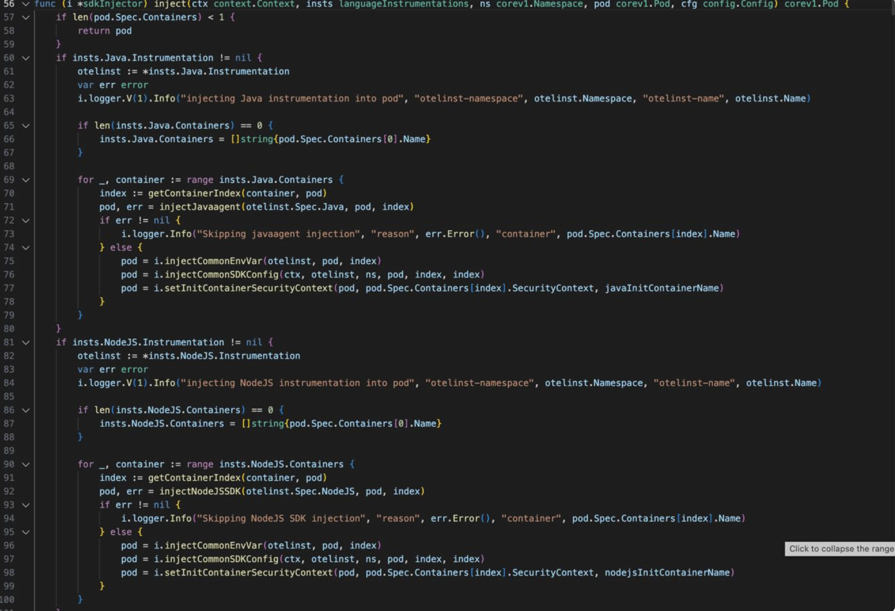

## Mutating Webhook을 이용한 Pod Inject

Otel operator에서 제공하는 Auto Instrunment는 Mutating Webhook을 이용한 Pod injecting이다

Pod Injecting을 설명하기 전에 쿠버네티스에서 리소스가 어떻게 etcd에 등록되는지 확인을 해야한다.

쿠버네티스의 경우 배포된 리소스가 etcd의 저장이되며 이는  `/regisry` 아래의 key-value 형식으로 프로토버퍼로서 저장 된다.

이는 아래 명령어를 통해 간단하게 확인할 수 있다.

```
etcdctl get /registry --prefix --keys-only
```

다만 etcd에 등록되기전 리소스는 mutaitng admission webhook server (이를 Dynamic Admission Control이라 함)를 거치게된다.

해당 서버는 리소스가 etcd에 등록이 되도 되는지, Reconsile을 통해서 Desired State를 하기 위해 적합한지 등을 체크한다.

즉,  Muatating admission부분이 존재하는데 해당 서버에서 reject 또는 accept을 통해 리소스를 등록하게 된다.

구조도는 아래와 같다.


위의 구조도를 보면 알 수 있지만 etcd에 등록되기전 admission webhook server에서 intercept가 가능한것을 확인할 수 있다.

이에 착안하여 내용을 intercept 후 내용을 바꿔치는 것으로 Pod Injtecting을 구현할 수 있다.

간략하게 flow를 설명하자면

1. request가 etcd에 등록되기 전 MutatingWEbhookConfiguration의 rule과 일치할경우 intercept를 한다.
2. MutatingWebhook은 webhook server에 reuqest를 review하는 과정을 가지고 mutating을 수행한다.

## opentelemetry-operator내에서 podmutator 코드 분석

webhook의 경우 podMutationWebhook의 struct의 임베딩된 Handle함수에서 처리됨

해당 함수는 controller의 reconsile함수와 마찬가지로 이벤트에 따라 발생되며 Handle의 경우 아직 살펴보지는 않았으나 위의 그림처럼 mutating하는 과정에서 발생할 것으로 추측됨.

아무튼  podMutationWebhook struct는 아래와 같다.


여기서 client는 `sigs.k8s.io/controller-runtime/pkg/clien`t이며 이는 operator-sdk에서 사용하는 client와 동일한 라이브러리이다.

컨트롤러 구조상 루프시에 pull방식으로 동작하기에 비동기는 아니라고 추측됨(mutax관련 코드가 없음)

따라서 mutating되는 과정에서 Handle을 호출하게 되고 임베딩된 p의 podMutator함수에 따라 아래 비즈니스 로직이 동작한다는 것을 알 수 있다

따라서 93라인의 pod, err = m.Mutate(ctx, ns, pod)에서 관련 정보를 넘기고 pod정보에서 metadata의 annotation을 파싱후의 Instrument코드를 실행하게 됨


아래는 Mutate코드임, 임베딩된 pm에서 Injecting을 할 것인지 체크함


만약 return되지 않고 왔다면 pm.sdkInjector.inject를 통해서 pod의 내용을 수정함.

수정되는 내용은 initContainer추가, java라면 환경변수 주입정도가 있다


아래는 inject함수임. 그렇게 복잡한 내용은 없고 특이사항이라면 pod 내용을 수정하고 해당 pod객체를 리턴한다는 것을 알 수 있다



여기까지가 opentelemetry-operator에 작성된 Instrument에 관한 내용이며 해당 내용을 참고하여 mutating webhook server를 구현한다면 Pod injecting이 가능할 것으로 보인다