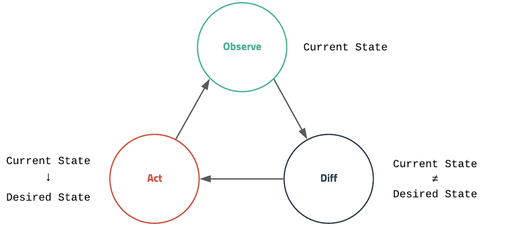
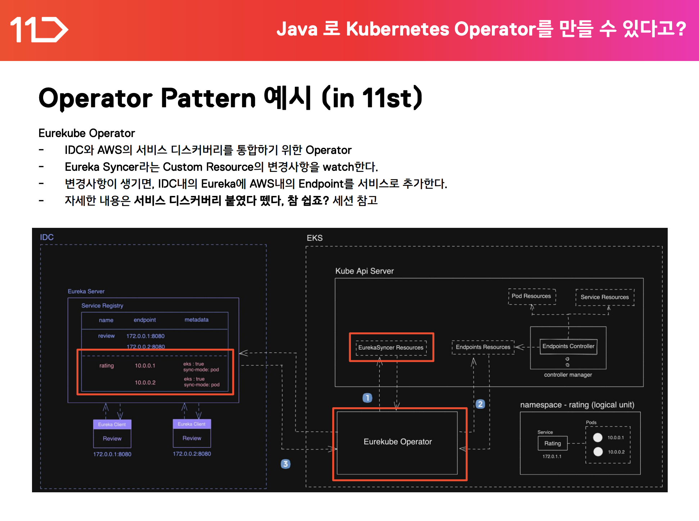
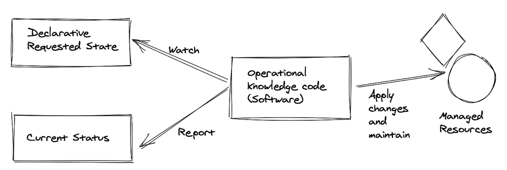
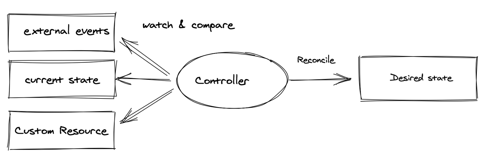

# Kubernetes Operator Pattern

애플리케이션을 쿠버네티스에 배포하게 되면 일정한 상태(`desired state`)를 유지하기 위해 쿠버네티스는 내부적으로 많은 변화가 발생한다.

이는 아래 사진과 같이 표현할 수 있다.

위와 같이 Observe - Report 이 두 가지 요소를 통해 쿠버네티스는 리소스를 배포한다.

 

그렇지만 비즈니스 로직이 커질수록 클러스터의 동작을 추가해야할 필요성은 높아졌고

여기서 2016년도 쯔음에 오퍼레이터 패턴이 등장하게 되었다.

문자 그대로 오퍼레이터(운영)을 소프트웨어로서 작성한 개념이라고 할 수 있다.

이러한 패턴에 대해서 자세한 설명은 CNCF White Paper에 기술되어 있다.

> https://github.com/cncf/tag-app-delivery/blob/eece8f7307f2970f46f100f51932db106db46968/operator-wg/whitepaper/Operator-WhitePaper_v1-0.md

 

Operator Pattern이란 이러한 관리를 위한 업무를 자동으로 해주기 위해 사용하기 위한 추가적인 요소이며, 다르게 표현하자면 클러스터의 동작을 확장하기 위해 사용한다고 할 수 있다.

주요 키 포인트는 아래와 같다.

* Kubernetes의 코드를 변경하지 않고 클러스터의 동작을 확장하기 위해 추가된 요소이다.
* Custom Resource를 따라 동작하는 컨트롤러를 이용한다.

 
그렇다면 Operator Pattern으로 무엇을 할 수 있는가에 대해 먼저 살펴보자면 

11번가의 경우 서비스 추가요소를 붙이기 위해 사용하였다고 한다.

> 출처: https://techtalk.11stcorp.com/2022/pdf/TECH-TALK-2022_SESSION-02.pdf

 

# Operator Pattern은 어떻게 동작하는가?

CNCF White Paper에 따르자면 Operator Pattern을 다음과 같이 표현한다.

이는 다음 3줄로 표현할 수 있다.

1. Declarative Requested State에 대하여 Software가 Watch한다.

2. Current Status에 Report한다. (desired status를 위하여)

3. 실제 리소스에 반영한다.

이러한 Operator는 새로운 도메인을 Operator의 API를 통해 구현하는 것을 목표로 하며, 이를 위해서는 3가지 특성이 보장되어야 한다.

* Dynamic Configuration(동적 구성)

* Operational Automation(운영 자동화)

* Domain Knowledge(도메인 지식)

 

오퍼레이터 패턴은 Controller를 통해서 대부분의 비즈니스 로직이 구현된다.

Controller는 External evnts, Current State, Custom Resoirce등을 watch하며 `desired state`인지 체크하고 아니라면

`Reconcile`을 통해서 해당 상태로 만들어간다.

