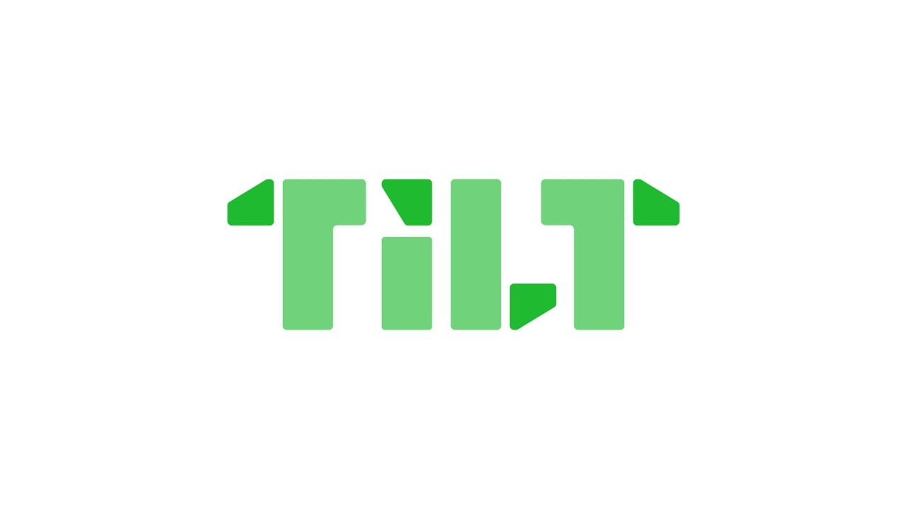
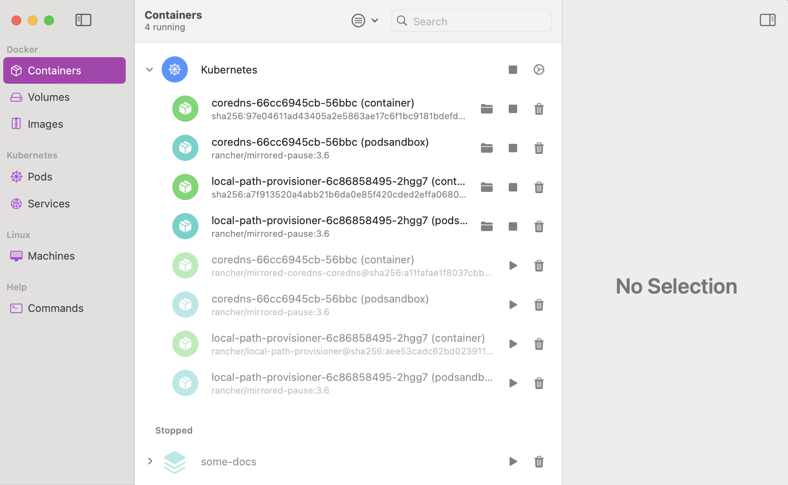
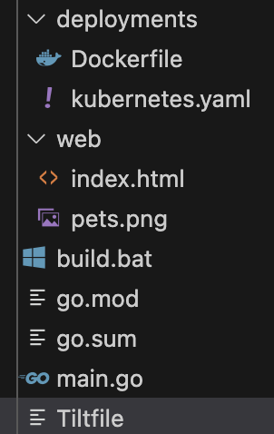
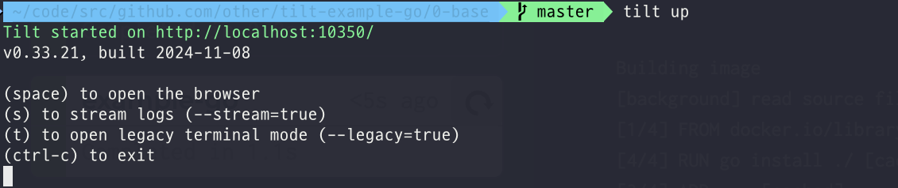
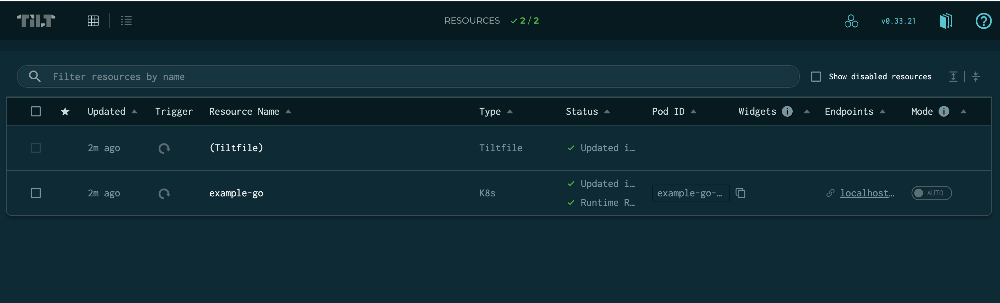
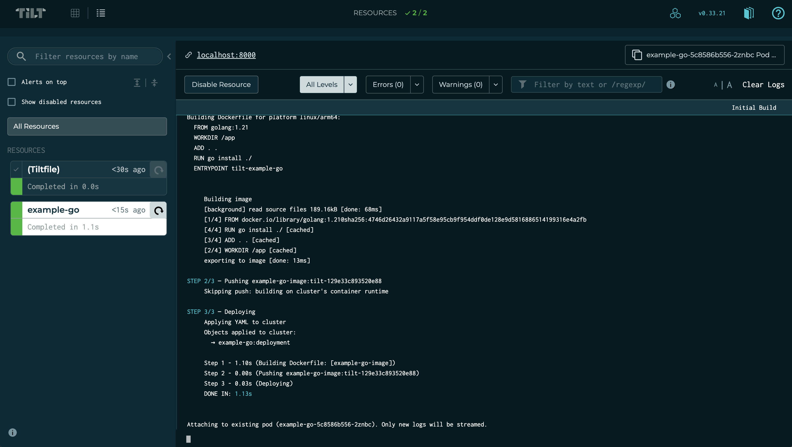
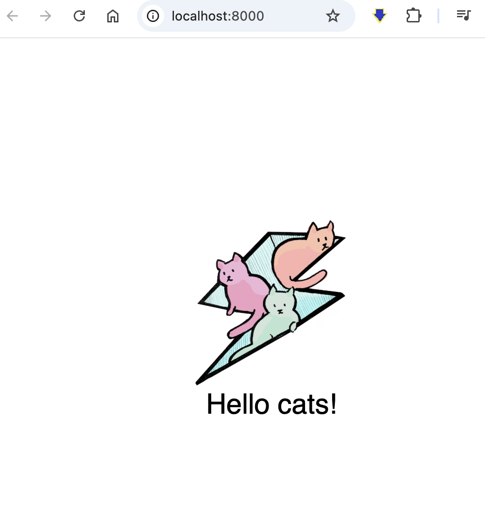

`Tilt`란 로컬 환경에서 애플리케이션을 쿠버네티스 환경에 배포를 반복적으로 돠우주는 도구이다.

기능을 여럿 지원하는데 여기서 리소스 감시와 같은 기능을 통해 로컬 변경사항이 생긴다면 이를 수정하고 배포하는 과정을 자동화 한다고 할 수 있다.


## 필수 요구사항

1. Tilt 설치

2. 쿠버네티스 환경이 셋업


## 가이드

우선 간단하게 사용할 목적으로 로컬 쿠버네티스를 셋업하였다.



셋업을 위해서 사용한 툴은 `OrbStack`을 이용하였으나 `kind`, `k3d`등 다른 스택을 사용하여도 무관하다.

정말 Tilt를 기동시키는게 목적이라면 아래 명령어를 통해 잘 실행되는지를 확인할 수 있다.

> tilt demo

그렇지만 오늘 볼것은 간단하게 Tilt를 사용하는 것이기에 데모 코드를 작성한다.


우선 필요한 것은 다음과 간다.

1. demo application
2. Dockerfile
3. k8s yaml
4. tilt file

아래는 Example에서 제공하는 Golang코드이다. 

코드에는 대단한 건 들어가지 않았고 단순히 8000포트를 통해 ./web 디렉터리의 리소스를 서빙하는 static http 서버이다.
```Golang
package main

import (
	"log"
	"net/http"

	"github.com/gorilla/mux"
)

type ExampleRouter struct {
	*mux.Router
}

func NewExampleRouter() *ExampleRouter {
	r := mux.NewRouter()

	fs := http.FileServer(http.Dir("./web"))
	r.PathPrefix("/").Handler(fs)

	return &ExampleRouter{
		Router: r,
	}
}

func main() {
	http.Handle("/", NewExampleRouter())

	log.Println("Serving on port 8000")
	err := http.ListenAndServe(":8000", nil)
	if err != nil {
		log.Fatalf("Server exited with: %v", err)
	}
}

```

그리고 Dockerfile을 작성한다.

```Dockerfile
FROM golang:1.21
WORKDIR /app
ADD . .
RUN go install ./
ENTRYPOINT tilt-example-go
```

그리고 k8s에 배포를 위해 Deployment를 작성한다

```yaml
apiVersion: apps/v1
kind: Deployment
metadata:
  name: example-go
  labels:
    app: example-go
spec:
  selector:
    matchLabels:
      app: example-go
  template:
    metadata:
      labels:
        app: example-go
    spec:
      containers:
      - name: example-go
        image: example-go-image
        ports:
        - containerPort: 8000
```

그리고 마지막으로 tiltfile을 작성한다. tiltfile은 `starlark`라는 문법으로 작성되는데 파이썬과 굉장히 유사하다.

순서대로 아래와 같다.


1. docker_build
    1. docker를 빌드한다. context와 dockerfile을 지정할 수 있다.
2. k8s_yaml
    1. 쿠버네티스에 배포할 yaml을 지정한다.
3. k8s_resource
    1. 로컬에서 바로 접속할 수 있도록 proxy를 선언한다.


```tiltfile
# -*- mode: Python -*-

docker_build('example-go-image', '.', dockerfile='deployments/Dockerfile')
k8s_yaml('deployments/kubernetes.yaml')
k8s_resource('example-go', port_forwards=8000)
```

대략 작성을 다하였다면 아래와 같은 프로젝트를 구조를 가질 것이다.




<br/>
<br/>

이제 터미널에서 아래 명령어를 입력한다.



이제 브라우저를 통해 tilt에서 application이 배포되었는지를 확인할 수 있다.







현재 어떤 리소스가 배포되었는지, 로그 등을 tilt를 통해 한번에 확인 가능하다.

또한 k8s_resource를 통해 proxy를 작성하였으니 엔드포인트를 통해 접속 또한 가능하다.




이것으로 간단하게 tilt를 사용하였는데 아직 많은 기능이 남아있다.

local_resource, test, helm등 여러가지 기능을 지원하니 만약 로컬에서 쿠버네티스 기반의 애플리케이션을 개발한다면 좋은 도구가 될 수 있다.

라이브 개발에 있어 tilt는 좋은 선택이 될 수 있지만 프로덕션 배포에 있어서는 고민할 거리가 많다.

아직까지는 gitops인 argocd가 좀더 현실적이라고 생각한다.