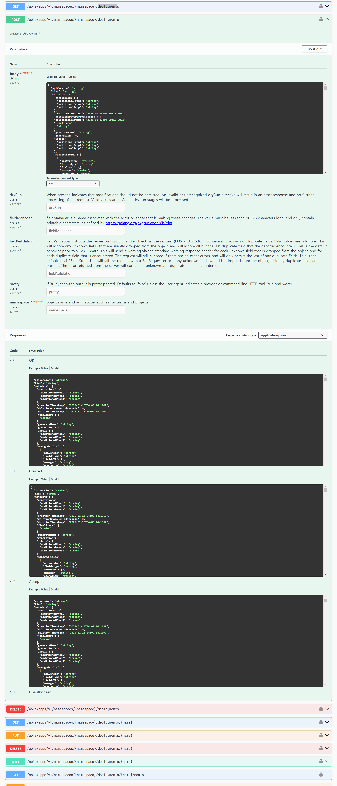
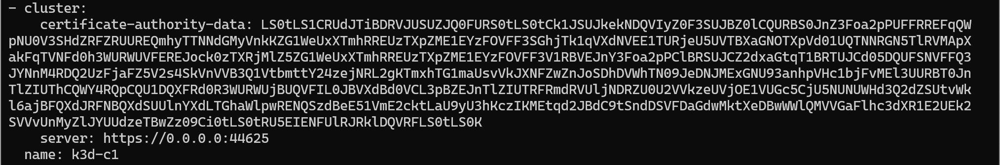
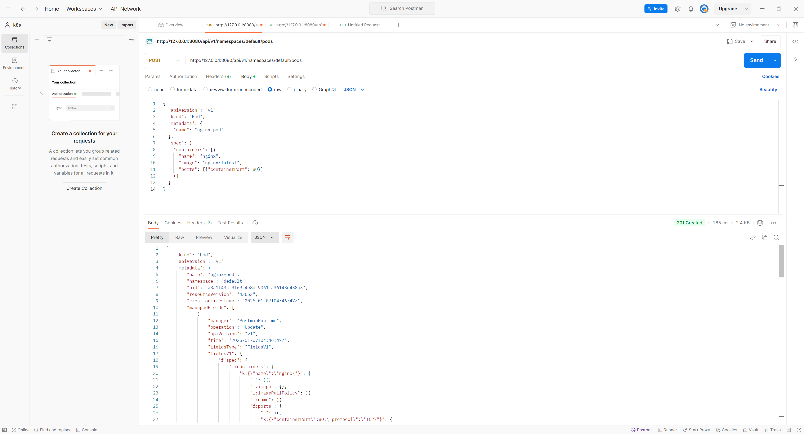

# K8S api 날려보기

쿠버네티스의 요소들은 kube api를 통해서 이루어진다.

가령 Pod 생성 또한 api를 통해서 처리된다.

Deployment를 만들었다고 하면 내부의 동작 시퀀스는 아래와 같다.


> 출처 : https://suhwan.dev/2019/04/22/understanding-kubernetes-design/


User는 API서버에 deployment 생성을 요청하고 내부의 Controller와 Scheduler가 Watch, Reconcile을 통해서 Pod을 배포하게 되는 것이 해당 시퀀스 다이어그램의 내용이다.

<br>

여기서 시퀀스 다이어그램을 보면 재밌는 것이 있는데 바로 동기 메시지의 리턴이 200, 201등으로 적혀있는 것을 확인할 수 있다.

<br>

이는 당연하겠지만 http 표준 status code이다. 즉 api서버와 통신 결과라고 할 수 있다.

https://www.iana.org/assignments/http-status-codes/http-status-codes.xhtml


User가 Create Deployment를 통해 Deployment 생성을 요청한 경우, etcd에 기록되었으니 201을 리턴 받게 되는 것이다.


아래는 Kubernetes v1.29.3의 해당 api에 대한 openapi 명세이다.




https://github.com/kubernetes/kubernetes/blob/master/api/openapi-spec/swagger.json


간단하게만 봐도 restapi와 다를 것이 없다. 필요한 것은 api 서버 주소 인증 방법만 있다면 리소스를 간단하게 띄울 수 있다.


# Kube api

쿠버네티스 api와 통신하기 위해서는 크게 두 가지가 필요하다.

1. Kubernetes api endpoint
2. Authorization

쿠버네티스 api endpoint는 쉽게 확인할 수 있다. kubectl를 쓴다면 더욱 빨리 확인할 수 있는데

`~/.kube/config`에 있는 파일을 확인하다면 api 서버의 주소를 알 수 있다.

아래를 보면 https인 주소에 접근하기 위해 pki와 server 주소를 확인할 수 있다.



따라서 사진에서의 api 서버 주소는 0.0.0.0:44625라고 할 수 있다.

<br>

우선 `kubectl proxy --port=8080 &` 을 통해 kube api를 8080으로 포워딩한다.

그리고 pod에 대해서 post를 날리면 201을 받아오는 것을 확인할 수 있다.



<br><br>

하지만 지금의 방법은 kubectl을 통해 api 서버에 직접 요청을 날린것이기에 인증 과정 없이 api와 통신이 되었다.

만약 api서버가 아닌 위치에서 통신할 경우 Service Account와 이를 접근할 수 있는 수단이 필요하다.

대표적으로 많이 쓰이는 것이 `Service Account Token`이다


Token은 아래의 요소를 통해 만들 수 있다.

```
apiVersion: v1
kind: Secret
metadata:
  name: default-token
  annotations:
    kubernetes.io/service-account.name: default
type: kubernetes.io/service-account-token
```

해당 service-account-token 타입으로 secret을 만들게되면 특정 시간의 lifetime을 가진 토큰을 가져올 수 있다.

해당 yaml에서는 default(지정안했을 경우 사용하는 SA)에 대한 token이다. k8s에서도 Default lifetime은 1시간이다.

이제 token과 api 주소를 알았으니 api날리면 아래와 같이 날릴 수 있다.


```
curl -X GET $APISERVER/api --header "Authorization: Bearer $TOKEN" --insecure
```

header에 토큰을 추가하면 되며, 인증서가 없기에 --insecure를 사용하였다.


# Pod에서 kube api 사용하기

이제 kube api를 이용하여 통신할 수 있다는 사실을 확인하였다.

이를 응용한다면 Application(Pod)내에서도 Kube api를 요청할 수 있다는 것이다.

하지만 앞에서 kube api요청을 위해서 토큰, pki등이 필요하다는 것을 알았다.

이를 주입하여 사용할 수도 있곘지만 Pod의 경우 훨씬 편리하다.

바로 Kubelet이 pki와 SA Token을 주입해주기 때문이다.


아래는 각각 Token와 pki위치이다.

1. `/var/run/secrets/kubernetes.io/serviceaccount/token`
2. `/var/run/secrets/kubernetes.io/serviceaccount/ca.crt`
3. `echo $KUBERNETES_SERVICE_HOST`

위 3가지 정보를 이용한다면 Pod에 할당되어 있는 RBAC로 kube api에 접근이 가능하다.

아래는 이를 이용하여 간단하게 Pod을 배포하는 샘플 코드이다.

```golang
// cmd/main.go
package main

import (
	"bytes"
	"crypto/tls"
	"encoding/json"
	"fmt"
	"io"
	"kube-api-test/go/pkg/model"
	"log"
	"net/http"
	"os"
)

func main() {
	err := realMain()

	if err != nil {
		fmt.Println(err)
	}
}

func realMain() error {
    token, err := os.ReadFile("/var/run/secrets/kubernetes.io/serviceaccount/token")
	if err != nil {
		return err
	}

	// api 서버 인증을 위한 pki
	caCert, err := os.ReadFile("/var/run/secrets/kubernetes.io/serviceaccount/ca.crt")
	if err != nil {
		return err
	}

	caCertPool := x509.NewCertPool()
	caCertPool.AppendCertsFromPEM(caCert)

	client := &http.Client{
		Transport: &http.Transport{
			TLSClientConfig: &tls.Config{
				RootCAs: caCertPool,
			},
		},
	}

	apiServerUrl := "https://" + os.Getenv("KUBERNETES_SERVICE_HOST")

	err = makePod(apiServerURL, token, "default")
	if err != nil {
		return err
	}

	return nil
}

func makePod(apiServer, token, namespace string) error {
	url := apiServer + "/api/v1/namespaces/" + namespace + "/pods"
	log.Printf("Request URL: %s\n", url)

	pod := &model.Pod{}
	pod.Fill_to_defaults()

	body, err := json.Marshal(pod)
	if err != nil {
		return fmt.Errorf("error marshalling Pod: %v", err)
	}

	req, err := http.NewRequest("POST", url, bytes.NewBuffer(body))
	if err != nil {
		return fmt.Errorf("error creating request: %v", err)
	}

	log.Printf("Request Method: %s\n", req.Method)
	log.Printf("Request URL: %s\n", req.URL)
	log.Printf("Request Headers: %v\n", req.Header)

	reqBody, err := io.ReadAll(req.Body)
	if err != nil {
		return fmt.Errorf("error reading request body: %v", err)
	}
	log.Printf("Request Body: %s\n", string(reqBody))

	req.Body = io.NopCloser(bytes.NewBuffer(body))

	req.Header.Add("Authorization", "Bearer "+token)
	req.Header.Add("Content-Type", "application/json")

	client := &http.Client{}
	resp, err := client.Do(req)
	if err != nil {
		return fmt.Errorf("error sending request: %v", err)
	}
	defer resp.Body.Close()

	if resp.StatusCode != http.StatusCreated {
		body, _ := io.ReadAll(resp.Body)
		return fmt.Errorf("Failed to create Pod. Status: %s, Response: %s", resp.Status, string(body))
	}

	response, err := io.ReadAll(resp.Body)
	if err != nil {
		return fmt.Errorf("error reading response body: %v", err)
	}

	log.Printf("Pod creation successful: %s\n", string(response))

	return nil
}


// pkg/models/pod.go
package model

type Pod struct {
	APIVersion string   `json:"apiVersion"`
	Kind       string   `json:"kind"`
	Metadata   Metadata `json:"metadata"`
	Spec       PodSpec  `json:"spec"`
}

type Metadata struct {
	Name      string `json:"name"`
	Namespace string `json:"namespace"`
}

type PodSpec struct {
	Containers []Container `json:"containers"`
}

type Container struct {
	Name  string           `json:"name"`
	Image string           `json:"image"`
	Ports []ContainerPorts `json:"ports"`
}

type ContainerPorts struct {
	ContainerPort int `json:"containerPort"`
}

func (pod *Pod) Fill_to_defaults() {
	// APIVersion과 Kind에 기본값 설정
	if pod.APIVersion == "" {
		pod.APIVersion = "v1"
	}
	if pod.Kind == "" {
		pod.Kind = "Pod"
	}

	// Metadata에 기본값 설정
	if pod.Metadata.Name == "" {
		pod.Metadata.Name = "default-pod"
	}
	if pod.Metadata.Namespace == "" {
		pod.Metadata.Namespace = "default"
	}

	// Container 정의
	if len(pod.Spec.Containers) == 0 {
		pod.Spec.Containers = []Container{
			{
				Name:  "default-container",
				Image: "nginx:latest",
				Ports: []ContainerPorts{
					{ContainerPort: 80},
				},
			},
		}
	} else {
		for i, v := range pod.Spec.Containers {
			if len(v.Ports) == 0 {
				pod.Spec.Containers[i].Ports = []ContainerPorts{
					{ContainerPort: 80},
				}
			}
		}
	}
}

```
