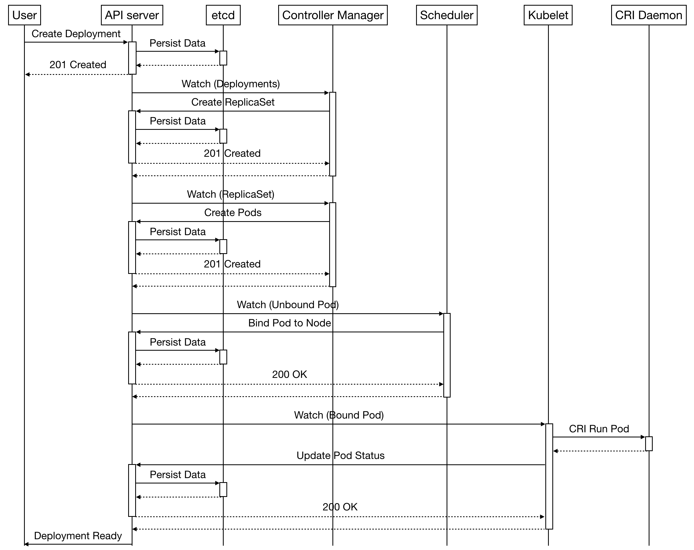

# K8S api 날려보기

쿠버네티스의 요소들은 kube api를 통해서 이루어진다.

가령 Pod 생성 또한 api를 통해서 처리된다.

Deployment를 만들었다고 하면 내부의 동작 시퀀스는 아래와 같다.

> 출처 : https://suhwan.dev/2019/04/22/understanding-kubernetes-design/

User는 API서버에 deployment 생성을 요청하고 내부의 Controller와 Scheduler가 Watch, Reconcile을 통해서 Pod을 배포하게 되는 것이 해당 시퀀스 다이어그램의 내용이다.

 

여기서 시퀀스 다이어그램을 보면 재밌는 것이 있는데 바로 동기 메시지의 리턴이 200, 201등으로 적혀있는 것이다.

 

이는 http 표준 status code이다. 즉 api서버와 통신 결과라고 할 수 있다.

https://www.iana.org/assignments/http-status-codes/http-status-codes.xhtml

etcd의 경우 infomer때문에 api가 아닌 캐시 서버로 거쳐갈 수도 있지만 왠만하면 api서버를 거친다고 할 수 있다.

다시 시퀀스 다이어그램으로 돌아외서 보면 User는 API server에 Deployment를 생성을 요청하면 etcd에 등록되게 된다.

이때 etcd에 요소가 생성되는 기준으로 동기 메시지의 리턴을 받는다는 것을 알 수 있다.

이를 생각한다면 엔드 포인트의 유저는 etcd의 등록되는 

https://github.com/kubernetes/kubernetes/blob/master/api/openapi-spec/swagger.json

