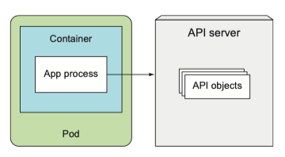
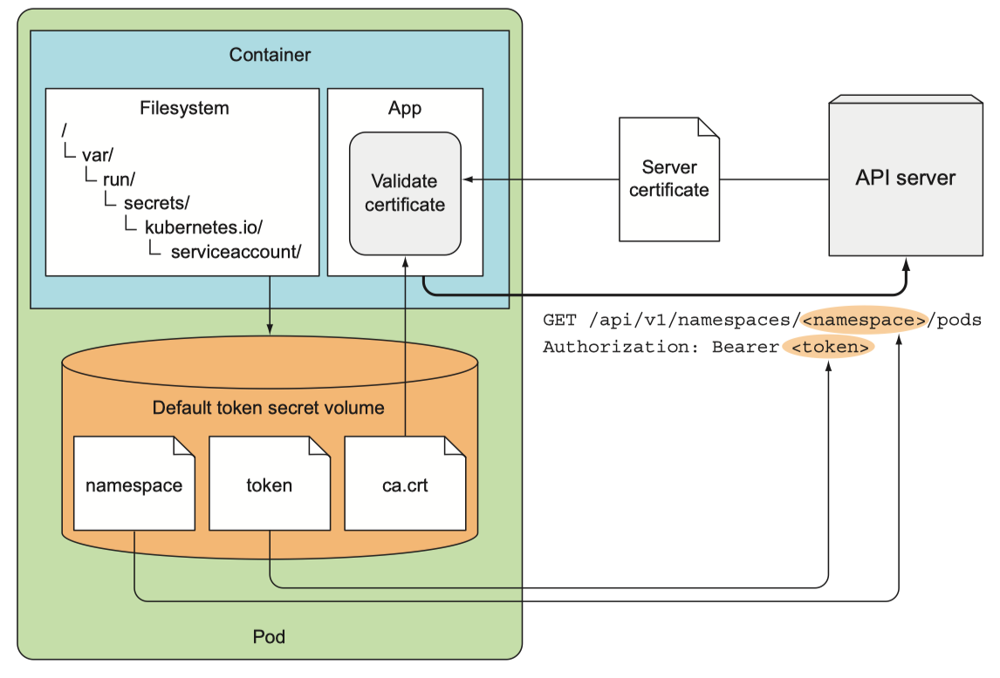
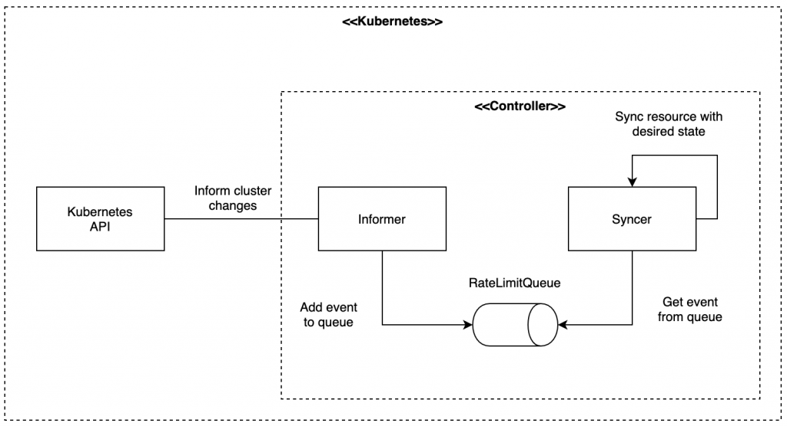
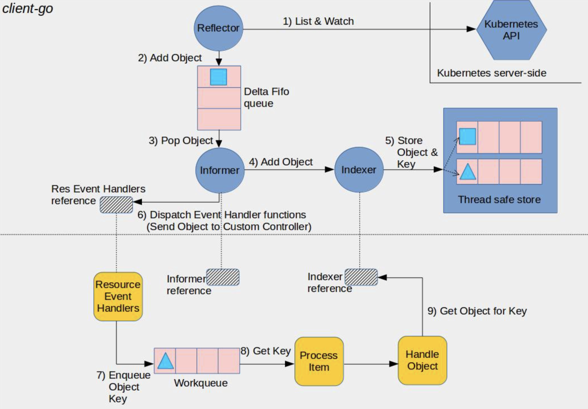
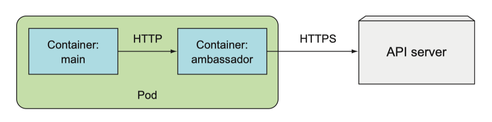
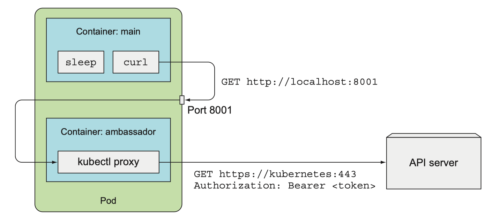

# Java client vs fabric 8 vs OSGi

Application에서 쿠버네티스에 대한 제어를 위해서는 Kube API 서버에 대한 접근이 필요하다.

그림으로 그리자면 아래와 같다.




`Application level`에서 k8s 제어를 위한 JAVA  지원하는 라이브러리는 다음과 같음

-  `kubernetes-client/java`, https://github.com/kubernetes-client/java

- `fabric8io/kubernetes-client`, https://github.com/fabric8io/kubernetes-client

-  `amdatu-kubernetes`, https://bitbucket.org/amdatulabs/amdatu-kubernetes/src/master/


<br>
<br>



<br>

각 클라이언트의 동작 자체은 K8S Rest API를 기반으로 작성되었기에 필요한 것은 다음과 같다.

* K8S API server 주소

* Service Account

* 통신 암호화를 위한 PKI (외부 노출시에는 반드시 필요, 토큰 탈취 후 클러스터 접근이 가능함)

<br>


# Application client vs K8S RestAPI

이전에 데모에선는 k8s의 RestAPI를 이용하여 리소스를 배포하였는데 위의 클라이언트 라이브러리와의 차이점에 대해 궁금할 것이다.

해당 부분은 저차원에서 고차원의 기능을 개발할 갈수록 차이가 극명해진다고 생각한다.


단순히 Pod, Service등을 삭제/추가하는 경우에는 K8S RestAPI나 client 라이브러리의 경우에는 차이가 없으며 단순히 Call시에 url, Parameter등의 차이밖에 없다.

이는 client 라이브러리 또한 K8S RestAPI를 이용하기 때문이다.

그럼에도 불구하고 client 라이브러리르 쓰는 이유가 있는데 바로 client 라이브러리를 통해 다른 리소스를 구현하기 위해서라고 할 수 있다.


쿠버네티스의 컨트롤러의 경우 상당히 많은 리소스가 있는데 그 중 `informer`, `watcher`라는 리소스가 있다.

그리고 클라이언트 라이브러리가 이러한 informer, watcher에 대한 구현체를 제공해준다.




informer에 대해서 간단하게 기술하자면 아래와 같다.

informer는 Kubernetes 클러스터와 Controller 사이에서 중개자 역할을 한다. informer는 특정 resource 타입에 대해 클러스터에서 변화가 생길 때마다 해당 이벤트를 들을 수 있는 이벤트 핸들러를 등록할 수 있다.

이벤트 핸들러를 통해 넘어온 이벤트들은 보통 큐에 저장하고 Controller는 큐의 반대편에서 informer가 넘긴 이벤트를 구독하여 이벤트가 넘어올 때마다 이벤트의 타입에 따라서 적절하게 핸들링한다.

이벤트를 넘기는 로직, 이벤트 핸들러 등이 client 라이브러리를 통해서 작성된다고 할 수 있다.



위의 그림은 informer에 대해 구현을 도식화한 내용이다.

요는 리소스에 대한 이벤트의 구독, 발행에 대한 이벤트 처리를 위한다고 할 수 있다.

자세한 내용은 아래에 있는 블로그에 기술되어 있다.

> https://blog.dsb.dev/posts/creating-dynamic-informers/

이는 `Watcher`에 경우에도 동일하다.

# kubernetes-client/java

해당 라이브러리는 Operator SDK에서도 차용되는 API이며 공식 문서를 본다면 leader election, Controller등을 지원한다.

다만 함수의 경우 편의성에서 다소 떨어진다는 점을 받았다.

아래는 NodeInformer를 정의하는 로직이다.

kubernetes-client/java의 특이한 부분은 coreV1Api 패키지내의 함수들의 매개변수들이 null이 들어가는 것이다.

정확하게는 --dry-run등 kube API에 가까운 옵션들을 지원하기에 대부분의 코드에서 null이 들어가는 것이다.


```Java
ApiClient client = Config.defaultClient();
Configuration.setDefaultApiClient(client);

CoreV1Api coreV1Api = new CoreV1Api();
OkHttpClient httpClient =
    client.getHttpClient().newBuilder().readTimeout(0, TimeUnit.SECONDS).build();
client.setHttpClient(httpClient);

SharedInformerFactory factory = new SharedInformerFactory(client);

// Node informer
SharedIndexInformer<V1Node> nodeInformer =
    factory.sharedIndexInformerFor(
        (CallGeneratorParams params) -> {
          return coreV1Api.listNodeCall(
              null,
              null,
              null,
              null,
              null,
              null,
              params.resourceVersion,
              null,
              params.timeoutSeconds,
              params.watch,
              null);
        },
        V1Node.class,
        V1NodeList.class);

nodeInformer.addEventHandler(
    new ResourceEventHandler<V1Node>() {
      @Override
      public void onAdd(V1Node node) {
                                   System.out.printf("%s node added!\n", node.getMetadata().getName());
                                                                                                       }

      @Override
      public void onUpdate(V1Node oldNode, V1Node newNode) {
        System.out.printf(
            "%s => %s node updated!\n",
            oldNode.getMetadata().getName(), newNode.getMetadata().getName());
      }

      @Override
      public void onDelete(V1Node node, boolean deletedFinalStateUnknown) {
        System.out.printf("%s node deleted!\n", node.getMetadata().getName());
      }
    });

factory.startAllRegisteredInformers();
Thread.sleep(10 * 1000L);
factory.stopAllRegisteredInformers();
```

그렇지만 특정 부분이 쓰기 불편하고 예제가 없는 것이지 못 쓸 정도는 아닌것으로 보인다.

아래는 Deployment를 작성하는 예시이다. builder를 이용하여 Deployment 리소스를 생성한다.

Deployment, StatatefullSet과 같은 단위에는 Builder를 이용하여 배포하는 것으로 보인다.

``` Java
  public static void main(String[] args) throws IOException, ApiException {
    ApiClient client = Config.defaultClient();
    Configuration.setDefaultApiClient(client);
    AppsV1Api appsV1Api = new AppsV1Api(client);

    String deploymentName = "example-nginx";
    String imageName = "nginx:1.21.6";
    String namespace = "default";

    // Create an example deployment
    V1DeploymentBuilder deploymentBuilder =
        new V1DeploymentBuilder()
            .withApiVersion("apps/v1")
            .withKind("Deployment")
            .withMetadata(new V1ObjectMeta().name(deploymentName).namespace(namespace))
            .withSpec(
                new V1DeploymentSpec()
                    .replicas(1)
                    .selector(new V1LabelSelector().putMatchLabelsItem("name", deploymentName))
                    .template(
                        new V1PodTemplateSpec()
                            .metadata(new V1ObjectMeta().putLabelsItem("name", deploymentName))
                            .spec(
                                new V1PodSpec()
                                    .containers(
                                        Collections.singletonList(
                                            new V1Container()
                                                .name(deploymentName)
                                                .image(imageName))))));
    appsV1Api.createNamespacedDeployment(
        namespace, deploymentBuilder.build()).execute();
}
```

복잡해 보이지만 내부 클래스를 본다면 k8s api와 유사한 느낌을 준다고 한다.


<br>

# fabric8io/kubernetes-client

가장 오래된 K8S java client 라이브러리이다.

그만큼 사용자 수, 유즈케이스등이 kubernetes/java-client에 비해 많다.


아래는 Client 객체를 생성하는 에제이다.

```Java
new KubernetesClientBuilder().build()
```


아래는 Informer를 생성하는 예제 코드이다.

```Java 
try (KubernetesClient client = new KubernetesClientBuilder().build()) {
  SharedIndexInformer<Node> nodeInformer = client.nodes()
      .inform(new ResourceEventHandler<Node>() {
        @Override
        public void onAdd(Node node) {
          System.out.printf("%s node added", node.getMetadata().getName());
        }

        @Override
        public void onUpdate(Node oldNode, Node newNode) {
          System.out.printf("%s => %s node updated!", oldNode.getMetadata().getName(), newNode.getMetadata().getName());
        }

        @Override
        public void onDelete(Node node, boolean b) {
          System.out.printf("%s DELETED", node.getMetadata().getName());
        }
      }, 30 * 1000L);

  Thread.sleep(10 * 1000L);

  nodeInformer.close();
} catch (InterruptedException e) {
  Thread.currentThread().interrupt();
  System.out.println("interrupted");
}
```


아래는 Deployment를 배포하는 예제이다. builder구현채를 이용하는데

해당 구현체는 kubernetes/java-client와 동일한 구현체를 이용한다고 한다.

```Java
try (KubernetesClient client = new KubernetesClientBuilder().build()) {
  GenericKubernetesResource genericKubernetesResource = client.genericKubernetesResources("v1", "Namespace")
      .withName("default")
      .get();

  Map<String, String> labels = genericKubernetesResource.getMetadata().getLabels();
  labels.put("foo", "bar");
  genericKubernetesResource.getMetadata().setLabels(labels);

  client.genericKubernetesResources("v1", "Namespace")
      .resource(genericKubernetesResource)
      .replace();
}
```

<br>

# amdatu-kubernetes

OSGi 프로젝트용이라 해당 문서에서는 다루지 않음


# fabric8io/kubernetes-client 와 kubernetes-client/java 의 차이점

두 라이브러리도 K8S api 서버에 대한 RestAPI를 기반으로 동작한다.

fabric8 k8s client는 Fabric8 프로젝트의 PaaS에서 나온것이 원점이다.


kubernetes java client는 OpenAPI Gen Sript인 kubernetes-client/gen을 통해서 생성되었다고 추측되며, 그렇기에 다른 클라이언트와 사용법이 유사하다고 한다.


<br>

지원하는 패키지 차이
```
+--------------------------------+---------------------------------+
|   Fabric8 Kubernetes Client    | Official Kubernetes Client      |
+--------------------------------+---------------------------------+
| kubernetes-model,              | client-java,                    |
| kubernetes-client,             | client-java-api,                |
| kubernetes-client-api,         | client-java-extended,           |  
| openshift-model,               | client-java-proto,              |        
|                                | client-java-fluent,             |
| openshift-client,              | client-java-spring-integration  | 
| openshift-server-mock,         | client-java-prometheus-operator-| 
|                                |                    models,      |
|                                | client-java-cert-manager-models | 
|                                |                                 |
| kubernetes-httpclient-jdk,     |                                 |
| kubernetes-httpclient-jetty,   |                                 |
| kubernetes-httpclient-okhttp,  |                                 |
| kubernetes-openshift-uberjar,  |                                 |
| crd-generator                  |                                 |
| java-generator-core            |                                 |
| java-generator-maven-plugin    |                                 |
| kubernetes-junit-jupiter       |                                 |
| kubernetes-server-mock,        |                                 |
| kubernetes-junit-jupiter       |                                 |
| knative-model,                 |                                 |
| knative-client,                |                                 |
| tekton-model-v1alpha1,         |                                 |
| tekton-model-v1beta1,          |                                 |
| tekton-client,                 |                                 |
| servicecatalog-client,         |                                 |
| servicecatalog-model,          |                                 |
| volumesnapshot-client,         |                                 |
| volumesnapshot-model,          |                                 |
| chaosmesh-client,              |                                 |
| chaosmesh-model,               |                                 |    
| istio-client,                  |                                 |
| istio-model,                   |                                 |
| open-cluster-management-model, |                                 |                       | open-cluster-management-client |                                 |
+--------------------------------+---------------------------------+
```


두 패키지의 경우, 리소스 생성에 있어서는 큰 차이점이 없지만 확인하였을때 두 가지 정도에 있어서 동작하는 방식이 다릅니다.

대표적으로 watch함수 정도 있습니다. watch의 경우 단방향의 http Get 메서드만을 지원합니다.

* Fabiric8 kubernetes client의 경우 watch를 위해 WebSocket을 이용 (따로 구현체를 이용하는 듯)

* Kubernets client의 경우 http call이기에 thread와 이벤트 버스와 같은 것을 이용해야한다고 생각함 


<br>

# 엠베서더 컨테이너를 이용한 API 통신 프록시

쿠버네티스 API서버에 접근하기 위해서는 인증서, 토큰, 주소등의 정보를 가지고 있어야한다.

그렇지만 접근이 필요한 모든 컨테이너에 해당 권한을 부여하기에는 위험성이 크다.


따라서 이러한 방법을 완화시키기 위해 API서버에 proxy로 접근할 수 있는 컨테이너를 띄오고 해당 컨테이너에 API를 날리는 방법을 사용한다.

이를 엠베서더 패턴이라고 한다.



<br>

쿠버네티스에서 아래와 같이 동작한다.

