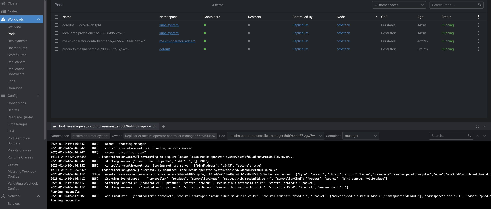

# Operator SDK

쿠버네테스에서 CRD를 쉽게 만들 수 있는 방법 중 하나가 Operator SDK이다.


# 준비

설치는 굉장히 간단하다. macos라면 brew를 통해 설치가 가능하다.

```shell
brew install operator-sdk
```

operator-sdk를 설치한다고 해도 끝은 아니고...의존성을 설치하여야 한다.

우서 kubernetes-cli과 golang을 설치한다.

```shell
brew install kubernetes-cli
```

```shell
brew install golang
```

golang을 설치 후 아래와 같이 GOPATH를 설정한다. 통상적으로는 유저 디렉터리 go디렉터리를 생성 후 지정한다.

해당 디렉터리는 golaps 백엔드를 통해서 받아오는 파일 등 여럿 요소들이 저장되는 디렉터리이다.

그 이외의 GOROOT, GOBIN등은 homebrew를 통해서 설치되니 큰 고민 없이 사용하면 된다.

```shell
export GOPATH="/Users/user/go"
export PATH=${PATH}:$GOPATH/pkg
export PATH=${PATH}:$GOPATH/bin
```

# Init

기본 준비가 되었다면 프로젝트를 생성할 것이다.

```shell
mkdir ./sample-project

cd ./sample-project
```

아래 명령어를 통해 Operator SDK 프로젝트를 생성한다

```shell
operator-sdk init --domain=aihub.metabuild.co.kr
```


아래 명령어를 통해 mesim 그룹이며 kind가 Product인 CR과 컨트롤러를 생성한다.

```shell
operator-sdk create api  --group=mesim --version=v1 --kind=Product --controller --resource=true
```

여기까지 생성한다면 프로젝트의 구조는 다음과 같다.

```
.
├── Dockerfile
├── Makefile
├── PROJECT
├── README.md
├── api
│   └── v1
│       ├── groupversion_info.go
│       ├── product_types.go
│       └── zz_generated.deepcopy.go
├── cmd
│   └── main.go
├── config
│   ├── crd
│   │   ├── bases
│   │   │   └── mesim.aihub.metabuild.co.kr_products.yaml
│   │   ├── kustomization.yaml
│   │   └── kustomizeconfig.yaml
│   ├── default
│   │   ├── kustomization.yaml
│   │   ├── manager_metrics_patch.yaml
│   │   └── metrics_service.yaml
│   ├── manager
│   │   ├── kustomization.yaml
│   │   └── manager.yaml
│   ├── manifests
│   │   └── kustomization.yaml
│   ├── prometheus
│   │   ├── kustomization.yaml
│   │   └── monitor.yaml
│   ├── rbac
│   │   ├── kustomization.yaml
│   │   ├── leader_election_role.yaml
│   │   ├── leader_election_role_binding.yaml
│   │   ├── metrics_auth_role.yaml
│   │   ├── metrics_auth_role_binding.yaml
│   │   ├── metrics_reader_role.yaml
│   │   ├── product_editor_role.yaml
│   │   ├── product_viewer_role.yaml
│   │   ├── role.yaml
│   │   ├── role_binding.yaml
│   │   └── service_account.yaml
│   ├── samples
│   │   ├── kustomization.yaml
│   │   └── mesim_v1_product.yaml
│   └── scorecard
│       ├── bases
│       │   └── config.yaml
│       ├── kustomization.yaml
│       └── patches
│           ├── basic.config.yaml
│           └── olm.config.yaml
├── go.mod
├── go.sum
├── hack
│   └── boilerplate.go.txt
├── internal
│   └── controller
│       ├── product_controller.go
│       ├── product_controller_test.go
│       └── suite_test.go
├── mesim.yaml
├── operator-testing.yaml
├── pkg
│   └── product
│       └── nginx.go
└── test
    ├── e2e
    │   ├── e2e_suite_test.go
    │   └── e2e_test.go
    └── utils
        └── utils.go

```

굉장히 많은 파일이 있지만 실제로 비즈니스 로직이 들어가는 파일은 아래 두개입니다.

> api/v1/product_types.go

> internal/controller/product_controller.go


api/v1/product_types.go의 내용은 아래와 같습니다.

여기서 저희가 선언한 Kind형태인 Product는 struct로 정의되고 해당 Struct는 Controller에서 kube api로 요청을 날릴때 Json형식으로 Marshal되어 들어갑니다.


```golang
// api/v1/product_types.go
/*
Copyright 2025.

Licensed under the Apache License, Version 2.0 (the "License");
you may not use this file except in compliance with the License.
You may obtain a copy of the License at

    http://www.apache.org/licenses/LICENSE-2.0

Unless required by applicable law or agreed to in writing, software
distributed under the License is distributed on an "AS IS" BASIS,
WITHOUT WARRANTIES OR CONDITIONS OF ANY KIND, either express or implied.
See the License for the specific language governing permissions and
limitations under the License.
*/

package v1

import (
	metav1 "k8s.io/apimachinery/pkg/apis/meta/v1"
)

// EDIT THIS FILE!  THIS IS SCAFFOLDING FOR YOU TO OWN!
// NOTE: json tags are required.  Any new fields you add must have json tags for the fields to be serialized.

// ProductSpec defines the desired state of Product
type ProductSpec struct {
	// INSERT ADDITIONAL SPEC FIELDS - desired state of cluster
	// Important: Run "make" to regenerate code after modifying this file

	// Foo is an example field of Product. Edit product_types.go to remove/update
	// Foo   string `json:"foo,omitempty"`
	Type    string        `json:"type"`
	Image   string        `json:"image"`
	Service ProductServce `json:"service"`
}

type ProductServce struct {
	Type string `json:"type"`
}

// ProductStatus defines the observed state of Product
type ProductStatus struct {
	// INSERT ADDITIONAL STATUS FIELD - define observed state of cluster
	// Important: Run "make" to regenerate code after modifying this file
}

// +kubebuilder:object:root=true
// +kubebuilder:subresource:status

// Product is the Schema for the products API
type Product struct {
	metav1.TypeMeta   `json:",inline"`
	metav1.ObjectMeta `json:"metadata,omitempty"`

	Spec   ProductSpec   `json:"spec,omitempty"`
	Status ProductStatus `json:"status,omitempty"`
}

// +kubebuilder:object:root=true

// ProductList contains a list of Product
type ProductList struct {
	metav1.TypeMeta `json:",inline"`
	metav1.ListMeta `json:"metadata,omitempty"`
	Items           []Product `json:"items"`
}

func init() {
	SchemeBuilder.Register(&Product{}, &ProductList{})
}

```


ProductSpec만 살펴보자면 yaml에서 Resource로 만들때 spec 아래로 들어가는 부분이라고 할 수 있습니다.

``` Golang
type ProductSpec struct {
	// INSERT ADDITIONAL SPEC FIELDS - desired state of cluster
	// Important: Run "make" to regenerate code after modifying this file

	// Foo is an example field of Product. Edit product_types.go to remove/update
	// Foo   string `json:"foo,omitempty"`
	Type    string        `json:"type"`
	Image   string        `json:"image"`
	Service ProductServce `json:"service"`
}
```

해당 Struct를 토대로 yaml을 만든다면 아래와 같이 만들고 컨트롤러에서 주입이 가능합니다.

``` yaml
apiVersion: mesim.aihub.metabuild.co.kr/v1
kind: Product
metadata:
  name: products-mesim-sample
  namespace: default
spec:
  type: "agent"
  image: "nginx:latest"
  service: 
    type: "NodePort"
```


<br>

아래는 Reeconcile이 수행되는 Controller입니다.

Controller는 간단한 Deployment하나를 만들고 finalizer를 붙이는 아주 간단한 예시입니다.


``` Golang
/*
Copyright 2025.

Licensed under the Apache License, Version 2.0 (the "License");
you may not use this file except in compliance with the License.
You may obtain a copy of the License at

    http://www.apache.org/licenses/LICENSE-2.0

Unless required by applicable law or agreed to in writing, software
distributed under the License is distributed on an "AS IS" BASIS,
WITHOUT WARRANTIES OR CONDITIONS OF ANY KIND, either express or implied.
See the License for the specific language governing permissions and
limitations under the License.
*/

package controller

import (
	"context"
	"fmt"

	appsv1 "k8s.io/api/apps/v1"
	v1 "k8s.io/api/core/v1"
	"k8s.io/apimachinery/pkg/api/errors"
	metav1 "k8s.io/apimachinery/pkg/apis/meta/v1"
	"k8s.io/apimachinery/pkg/runtime"

	ctrl "sigs.k8s.io/controller-runtime"
	"sigs.k8s.io/controller-runtime/pkg/client"
	"sigs.k8s.io/controller-runtime/pkg/controller/controllerutil"
	"sigs.k8s.io/controller-runtime/pkg/log"

	mesimv1 "git.aihub.metabuild.co.kr/mesim-operator/api/v1"
)

const finalizer = "product.mesim.aihub.metabuild.co.kr/application_controller_finalizer"

// ProductReconciler reconciles a Product object
type ProductReconciler struct {
	client.Client
	Scheme *runtime.Scheme
}

// +kubebuilder:rbac:groups=mesim.aihub.metabuild.co.kr;apps,resources=products;deployments,verbs=get;list;watch;create;update;patch;delete
// +kubebuilder:rbac:groups=mesim.aihub.metabuild.co.kr;apps,resources=products/status,verbs=get;update;patch
// +kubebuilder:rbac:groups=mesim.aihub.metabuild.co.kr;apps,resources=products/finalizers,verbs=update

// Reconcile is part of the main kubernetes reconciliation loop which aims to
// move the current state of the cluster closer to the desired state.
// TODO(user): Modify the Reconcile function to compare the state specified by
// the Product object against the actual cluster state, and then
// perform operations to make the cluster state reflect the state specified by
// the user.
//
// For more details, check Reconcile and its Result here:
// - https://pkg.go.dev/sigs.k8s.io/controller-runtime@v0.18.4/pkg/reconcile
func (r *ProductReconciler) Reconcile(ctx context.Context, req ctrl.Request) (ctrl.Result, error) {
	logger := log.FromContext(ctx)

	var app mesimv1.Product

	fmt.Println("Running reconcile")

	if err := r.Get(ctx, req.NamespacedName, &app); err != nil {
		logger.Error(err, "Can't get resource from mesimv1.Product")
		// if errors.IsNotFound(err) {
		// 	return ctrl.Result{}, nil
		// }

		return ctrl.Result{}, err
	}

	if !controllerutil.ContainsFinalizer(&app, finalizer) {
		logger.Info("Add finalizer")
		controllerutil.AddFinalizer(&app, finalizer)
		return ctrl.Result{}, r.Update(ctx, &app)
	}

	if !app.DeletionTimestamp.IsZero() {
		return r.reconcileDelete(ctx, &app)
	}

	deployment := appsv1.Deployment{
		ObjectMeta: metav1.ObjectMeta{
			Name:      app.ObjectMeta.Name,
			Namespace: app.ObjectMeta.Namespace,
			Labels:    map[string]string{"label": app.ObjectMeta.Name, "app": app.ObjectMeta.Name},
		},
		Spec: appsv1.DeploymentSpec{
			// Replicas: &app.Spec.Size,
			Replicas: int32Ptr(1),
			Selector: &metav1.LabelSelector{
				MatchLabels: map[string]string{"label": app.ObjectMeta.Name},
			},
			Template: v1.PodTemplateSpec{
				ObjectMeta: metav1.ObjectMeta{
					Labels: map[string]string{"label": app.ObjectMeta.Name, "app": app.ObjectMeta.Name},
				},
				Spec: v1.PodSpec{
					Containers: []v1.Container{
						{
							Name:  app.ObjectMeta.Name + "-container",
							Image: app.Spec.Image,
							Ports: []v1.ContainerPort{
								{
									// ContainerPort: app.Spec.Port,
									ContainerPort: 80,
								},
							},
						},
					},
				},
			},
		},
	}

	_, err := controllerutil.CreateOrUpdate(ctx, r.Client, &deployment, func() error {

		return nil
	})
	if err != nil {
		logger.Error(err, "Can't create Deployment or Update")
		return ctrl.Result{}, nil
	}

	return ctrl.Result{}, nil
}

func int32Ptr(i int32) *int32 {
	return &i
}

func (r *ProductReconciler) reconcileDelete(ctx context.Context, app *mesimv1.Product) (ctrl.Result, error) {
	l := log.FromContext(ctx)

	l.Info("Removing application")

	controllerutil.RemoveFinalizer(app, finalizer)
	err := r.Update(ctx, app)
	if err != nil {
		return ctrl.Result{}, fmt.Errorf("Error removing finalizer %v", err)
	}

	deployment := appsv1.Deployment{
		ObjectMeta: metav1.ObjectMeta{
			Name:      app.ObjectMeta.Name,
			Namespace: app.ObjectMeta.Namespace,
		},
	}
	err = r.Client.Delete(ctx, &deployment)
	if err != nil && !errors.IsNotFound(err) {
		return ctrl.Result{}, fmt.Errorf("Error deleting deployment: %v", err)
	}

	return ctrl.Result{}, nil
}

// SetupWithManager sets up the controller with the Manager.
func (r *ProductReconciler) SetupWithManager(mgr ctrl.Manager) error {
	return ctrl.NewControllerManagedBy(mgr).
		For(&mesimv1.Product{}).
		Complete(r)
}

```

앞서 RBAC, 기타 설정을 완료하고 CR 리소스를 생성하였을때 문제가 없다면 Reconcile함수가 트리거 된다. 


그뒤로는 k8s 라이브러리를 이용하여 k8s리소스를 생성한다.

Name, Namespaces는 Product type이 가지는 요소를 재활용하였으며, 나머지 요소들은 익히 알고 있는대로 정의하였다.

해당 예시에서는 Pod만 생성할 것이기에 nginx와 container port 80만 부여하였다.


우선 리소스가 제대로 삭제될 수 있도록 Finalizer를 부여합니다.

``` golang
    if !controllerutil.ContainsFinalizer(&app, finalizer) {
		logger.Info("Add finalizer")
		controllerutil.AddFinalizer(&app, finalizer)
		return ctrl.Result{}, r.Update(ctx, &app)
	}

```


그리고 Deployment를 배포하기위해 아래 로직을 통해 배포합니다.

``` Golang
	deployment := appsv1.Deployment{
		ObjectMeta: metav1.ObjectMeta{
			Name:      app.ObjectMeta.Name,
			Namespace: app.ObjectMeta.Namespace,
			Labels:    map[string]string{"label": app.ObjectMeta.Name, "app": app.ObjectMeta.Name},
		},
		Spec: appsv1.DeploymentSpec{
			// Replicas: &app.Spec.Size,
			Replicas: int32Ptr(1),
			Selector: &metav1.LabelSelector{
				MatchLabels: map[string]string{"label": app.ObjectMeta.Name},
			},
			Template: v1.PodTemplateSpec{
				ObjectMeta: metav1.ObjectMeta{
					Labels: map[string]string{"label": app.ObjectMeta.Name, "app": app.ObjectMeta.Name},
				},
				Spec: v1.PodSpec{
					Containers: []v1.Container{
						{
							Name:  app.ObjectMeta.Name + "-container",
							Image: app.Spec.Image,
							Ports: []v1.ContainerPort{
								{
									// ContainerPort: app.Spec.Port,
									ContainerPort: 80,
								},
							},
						},
					},
				},
			},
		},
	}

	_, err := controllerutil.CreateOrUpdate(ctx, r.Client, &deployment, func() error {

		return nil
	})
```

controllerutil을 제공하기에 아래 명령어를 통해 손쉽게 리소스를 배포 가능하다.

> controllerutil.CreateOrUpdate()

그리고 마지막으로 reconcile result struct를 리턴하는데 에러가 없었으니 공란으로 리턴한다.

```
return ctrl.Result{}, nil
```

만약 에러나 기타 이유를 통해 Reconcile이 재기동이 필요하다면 Requeue: true를 통해 큐에 다시 넣는것이 가능하다.

여기까지 하였다면 이전에 만든 yaml을 배포하는 것으로 컨트롤러가 동작하는지 확인할 수 있다.


아래 명령어를 통해 operator sdk를 빌드하고 클러스터에 배포한다.

배포시에는 Operator에 대한 이미지와 이미지 저장소가 필요하니 잊지 않도록 한다.

```
make generate

make manifest

make deploy
```

배포가 정상적으로 되었다면 아래 명령어를 통해 CRD가 제대로 배포되었는지 확인할 수 있다.

```
kubectl get crd

NAME                                   CREATED AT
addons.k3s.cattle.io                   2025-01-14T02:27:57Z
etcdsnapshotfiles.k3s.cattle.io        2025-01-14T02:27:57Z
helmcharts.helm.cattle.io              2025-01-14T02:27:57Z
helmchartconfigs.helm.cattle.io        2025-01-14T02:27:57Z
products.mesim.aihub.metabuild.co.kr   2025-01-14T04:45:38Z
```


배포 후 `kubectl apply -f mesim.yaml`을 통해 CR을 만든다면 products-mesim-sample-{해시값}으로 Deployment(pod)이 생성된 것을 확인할 수 있다.




<br>

감사합니다.