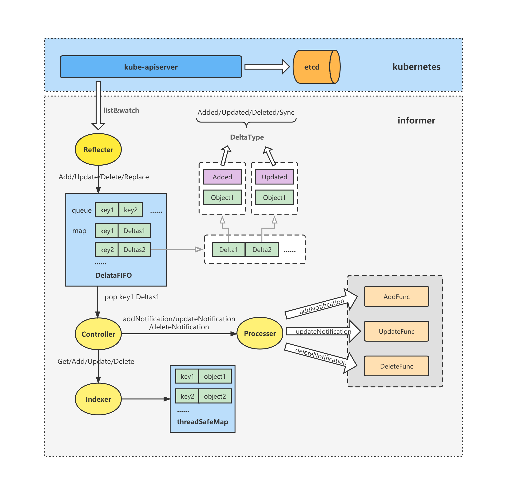
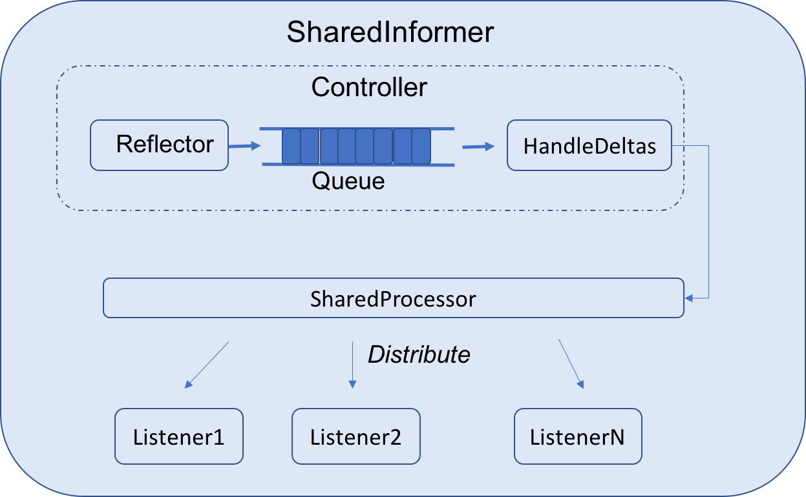

# K8S Java client와 Informer를 통해 쿠버네티스 이벤트 핸들링

쿠버네티스에서 컨트롤러를 구성하는 요소중 Informer라는 요소가 있다.

해당 요소는 client-go로 부터 시작되었으며 api Server로부터 이벤트를 받은 뒤 컨트롤러로 전달하기 위해 사용된다.




순서는 다음과 같다.

[Reflector]
1. api server로 부터 Resource Watch
2. 리소스 변경시 DeltaFIFO에 해당 Ojbect를 저장 (이때 전체 리소스가 아닌 DeltaType만을 저장)

[Controller]

3. Delta FIFO로부터 Object를 Pop한다.
4. Pop한 Object에 따라 이벤트 핸들러를 호출한다.
5. 해당 이벤트를 Indexer에 threadSafe한 Map에 저장한다.


그렇지만 Object에 대한 정보를 직접 가져오는것은 비싼 비용이 들어간다.

하물며 많은 컨트롤러가 같은 Object를 가져오는 것은 낭비라고 한다.


<br>

# SharedInformer

K8S Java Client의 객체내에서는 `SharedInformerFactory`라는 객체가 있다.

SharedInformer에 대한 구조는 다음과 같다.



<br>

쿠버네티스에서 Controller는 Ojbect대해서 계속 `Watch`를 해야한다.

다만 Ojbect 정보를 직접 가져오는 비용이 비싸며 중복이 있을 수도 있다.

따라서 공유 데이터 캐시를 두어 캐시 변경에 대한 Notification을 여러 리스너로 배포한다.

즉, Producer-Consumer 형태라고 할 수 있으며, Controller를 Producer로서 사용하며 이벤트를 생성한다고 할 수 있다.


SharedInformer에서 이벤트 핸들러를 등록할 수 있는데 이벤트 핸들러의 인터페이스는 아래와 같다.

이벤트 자체는 add, update, delete에 대해서 붙일 수 있다.

```Java
package io.kubernetes.client.informer;

import io.kubernetes.client.common.KubernetesObject;

public interface ResourceEventHandler<ApiType extends KubernetesObject> {

  void onAdd(ApiType obj);

  void onUpdate(ApiType oldObj, ApiType newObj);

  void onDelete(ApiType obj, boolean deletedFinalStateUnknown);
}
```


아래는 SharedInformer에서 Default 네임스페이스 Deployment에 대해 이벤트 핸들러를 등록하는 전체 예제이다.


```Java
import io.kubernetes.client.informer.*;
import io.kubernetes.client.openapi.models.*;
import io.kubernetes.client.util.CallGeneratorParams;
import io.kubernetes.client.util.Config;
import okhttp3.OkHttpClient;
import io.kubernetes.client.openapi.ApiClient;
import io.kubernetes.client.openapi.Configuration;
import io.kubernetes.client.openapi.apis.AppsV1Api;

import java.util.concurrent.CountDownLatch;
import java.util.concurrent.TimeUnit;

public class Informer {
    public static void main(String[] args) throws Exception {
        ApiClient apiClient = Config.defaultClient();
        Configuration.setDefaultApiClient(apiClient);

        // kubernets-client/java의 경우 통신 구현체로 OkHttp3를 사용함
        // http 클라이언트의 옵션 설정이 필요한 경우 사용
        OkHttpClient httpClient =
            apiClient.getHttpClient().newBuilder().readTimeout(0, TimeUnit.SECONDS).build();
        apiClient.setHttpClient(httpClient);

        // deployment객체는 appsv1에 존재함
        AppsV1Api appsV1Api = new AppsV1Api(apiClient);
        
        // factory 객체 생성 
        // 생성시 k8s api 접근하기 위한 인증 정보를 여기서 넘김
        SharedInformerFactory factory = new SharedInformerFactory(apiClient);

        // appsV1Api.listNamespacedDeployment에서 ~~.buildCall(null)로 리턴을 함
        // 해당 객체는 OkHttp3의 객체임
        // fabric8의 구현체와 다소 다름
        SharedIndexInformer<V1Deployment> deploymentInformer = factory.sharedIndexInformerFor(
                (CallGeneratorParams params) -> {
                    return appsV1Api.listNamespacedDeployment("default")
                            .resourceVersion(params.resourceVersion)
                            .watch(params.watch)
                            .timeoutSeconds(params.timeoutSeconds)
                            .buildCall(null);
                },
                V1Deployment.class,
                V1DeploymentList.class
        );

        // 핸들러 오버라이딩
        deploymentInformer.addEventHandler(new ResourceEventHandler<V1Deployment>() {
            @Override
            public void onAdd(V1Deployment deployment) {
                System.out.println("Deployment added: " + deployment.getMetadata().getName());
                printDeploymentStatus(deployment);
            }

            @Override
            public void onUpdate(V1Deployment oldDeployment, V1Deployment newDeployment) {
                System.out.println("Deployment updated: " + oldDeployment.getMetadata().getName() + " => " + newDeployment.getMetadata().getName());
                printDeploymentStatus(newDeployment);
            }

            @Override
            public void onDelete(V1Deployment deployment, boolean deletedFinalStateUnknown) {
                System.out.println("Deployment deleted: " + deployment.getMetadata().getName());
            }
        });

        // informer 객체 실행
        factory.startAllRegisteredInformers();
    }

    private static void printDeploymentStatus(V1Deployment deployment) {
        System.out.println("\n--------------------------------------");
        System.out.println("Deployment Name: " + deployment.getMetadata().getName());
        System.out.println("Namespace: " + deployment.getMetadata().getNamespace());
        System.out.println("Replicas: " + deployment.getSpec().getReplicas());
        System.out.println("Available Replicas: " + deployment.getStatus().getAvailableReplicas());
        System.out.println("Updated Replicas: " + deployment.getStatus().getUpdatedReplicas());
        System.out.println("Ready Replicas: " + deployment.getStatus().getReadyReplicas());
        System.out.println("Observed Generation: " + deployment.getStatus().getObservedGeneration());
        System.out.println("--------------------------------------\n");
    }
}

```


아래는 코드 실행후 샘픔 Deployment를 추가 후 삭제한 예시이다.

핸들러가 삭제/추가/업데이트에 있어서 정상적으로 동작한다는 것을 확인할 수 있다.


```console
Deployment added: nginx-deployment

--------------------------------------
Deployment Name: nginx-deployment
Namespace: default
Replicas: 3
Available Replicas: null
Updated Replicas: null
Ready Replicas: null
Observed Generation: null
--------------------------------------

Deployment updated: nginx-deployment => nginx-deployment

--------------------------------------
Deployment Name: nginx-deployment
Namespace: default
Replicas: 3
Available Replicas: null
Updated Replicas: null
Ready Replicas: null
Observed Generation: null
--------------------------------------

Deployment updated: nginx-deployment => nginx-deployment

--------------------------------------
Deployment Name: nginx-deployment
Namespace: default
Replicas: 3
Available Replicas: null
Updated Replicas: null
Ready Replicas: null
Observed Generation: 1
--------------------------------------

Deployment updated: nginx-deployment => nginx-deployment

--------------------------------------
Deployment Name: nginx-deployment
Namespace: default
Replicas: 3
Available Replicas: null
Updated Replicas: 3
Ready Replicas: null
Observed Generation: 1
--------------------------------------

Deployment updated: nginx-deployment => nginx-deployment

--------------------------------------
Deployment Name: nginx-deployment
Namespace: default
Replicas: 3
Available Replicas: 1
Updated Replicas: 3
Ready Replicas: 1
Observed Generation: 1
--------------------------------------
```


감사합니다.