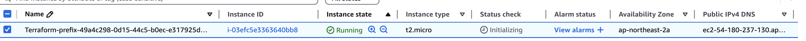

# Terraform과 tfexec

`Terraform`은 `Hashicorp`에서 개발한 클라우드 인프라스턱처의 자동화 도구이며, 이를 Infrastructure as Code(IaC)라고 부른다.

이러한 `Terraform`의 특징은 HCL(HashiCorp configuration language)을 이용한다는 것인데 이는 CLI tool과 인간과 기계 모두에게 친화적인 툴킷이라고 한다.

HCL을 통해 리소스를 정의하고 `Terraform`을 통해서 프로바이더(CSP)에 배포를 자동화한다고 할 수 있다.

# Terraform 동작 순서

`Terraform`의 동작 순서는 하기와 같다.

1. terraform init
    -> .terraform/providers 및 모듈 다운로드 진행
    -> 동시성 처리를 위해 Hash를 기록하는 .terraform.lock.hcl 생성
2. terraform plan
    -> 변경 점 시사
3. terraform apply
    -> terraform을 sdk등의 방법으로 provider에 배포
    -> 백엔드를 설정하지 않을 경우 로컬에 .tfsate파일을 통해 현재 상태 기록 

# Terraform 백엔드

`Terraform`의 경우 IaC도구로서 인프라와 작성된 리소스간의 일치가 중요하다.

이를 로컬이라면 tfstate로 관리되는데 굉장히 위험하다.

따라서 이를 기록할 수 있는 백엔드 지정은 필요하며 하기와 같이 설정이 가능하다.

```console
terraform {
  backend "s3" {
    bucket  = "your-bucket"
    key     = "your-object-name"
    region  = "your region"
    profile = "your profile"
  }
}
```

만약 tfstate와 프로바이더간의 데이터가 다를 경우 불일치가 발생한다.

이 경우 import를 통해 tfstate에 추가가 가능하다(0.15.4 이상)

그렇지 않은 경우 tfstate에 맞추기 위해 리소스를 삭제하게 된다.

# tfexec

Terraform의 경우 대부분은 명령어로 이용하게 되지만 당연하게도 프로그래밍 언어에서도 사용은 가능하다.

os.exec()와 같이 실행도 되지만 라이브러리를 통해 tfexec를 지원하니 이를 통해 terraform을 실행할 수 있다.

하기 tf파일은 AWS에 t2.micro를 올리는 간단한 Terraform 코드이며 variable를 통해 특정 값을 주입받는다.

vpc, subnet, sg의 경우 기 생성된 리소스를 사용하였다.

common.tf
```hcl
terraform {
  required_providers {
    aws = {
      source  = "hashicorp/aws"
      version = "~> 5.0"
    }
  }

  required_version = ">= 1.3.0"
}

provider "aws" {
  region = "ap-northeast-2"
}

data "aws_vpc" "selected" {
  id = "vpc-097cd774c5662644f"
}

data "aws_subnet" "selected" {
  id = "subnet-01108b665701108be"
}

data "aws_security_group" "selected" {
  id = "sg-071e99bd067e80647"
}

resource "aws_instance" "example" {
  ami                         = "ami-0a463f27534bdf246"
  instance_type               = "t2.micro"
  subnet_id                   = data.aws_subnet.selected.id
  associate_public_ip_address = true

  vpc_security_group_ids = [data.aws_security_group.selected.id]
  user_data = <<-EOF
            #!/bin/bash
            mkdir -p /home/ec2-user/test
            echo "${var.url_some}" > /home/ec2-user/test/hello.txt
            EOF
  
  key_name = "RAPA-Seoul" 

  tags = {
    Name = "Terraform-${var.instance_name}"
  }
}
```


하기 코드는 tfexec를 간단하게 사용한 예제이다.

```go
package main

import (
	"context"
	"log"
	"os"
	"path/filepath"
	"resource-manager/pkg/logger"
	"runtime"
	"time"

	"github.com/google/uuid"
	"github.com/hashicorp/go-version"
	"github.com/hashicorp/hc-install/product"
	"github.com/hashicorp/hc-install/releases"
	"github.com/hashicorp/terraform-exec/tfexec"
	"go.uber.org/zap"
)

func main() {
	ctx := context.Background()

	installer := &releases.ExactVersion{
		Product: product.Terraform,
		Version: version.Must(version.NewVersion("1.3.0")),
	}

	execPath, err := installer.Install(context.Background())
	if err != nil {
		log.Fatalf("error installing Terraform: %s", err)
	}

	_, currentFile, _, _ := runtime.Caller(0)
	baseDir := filepath.Dir(currentFile)
	workingDir := filepath.Clean(filepath.Join(baseDir, "."))

	mainTf := filepath.Join(workingDir, "common.tf")
	if _, err := os.Stat(mainTf); os.IsNotExist(err) {
		log.Fatalf("common.tf not found at: %s", mainTf)
	}
	tf, err := tfexec.NewTerraform(workingDir, execPath)
	if err != nil {
		log.Fatalf("failed to create Terraform instance: %v", err)
	}

	if err := tf.Init(ctx, tfexec.Upgrade(true)); err != nil {
		log.Fatalf("terraform init failed: %v", err)
	}

	state, err := tf.Show(ctx)
	if err != nil {
		log.Fatalf("terraform show failed: %v", err)
	}

	if state.FormatVersion == "" {
		log.Fatal("terraform state format version is empty")
	} else {
		logger.Info("Terraform state format version: ", zap.Any("state", state))
	}

	uuid := uuid.New().String()

	logger.Info("UUID ", zap.Any("res", uuid))

	err = tf.Apply(ctx,
		tfexec.Var("instance_name=prefix-"+uuid),
		tfexec.Var("url_some="+uuid+".example.com"),
	)
	if err != nil {
		log.Fatalf("can't setup tf vars: %v", err)
	}
	logger.Info("Terraform apply completed successfully")

	time.Sleep(60 * time.Second)

	err = tf.Destroy(ctx,
		tfexec.Var("instance_name=prefix-"+uuid),
		tfexec.Var("url_some="+uuid+".example.com"))
	if err != nil {
		log.Fatalf("terraform apply failed: %v", err)
	}
}
```

아래는 실행하였을때 예시이다.

```console
2025-04-08T21:28:13.629+09:00	INFO	tf/main.go:58	Terraform state format version: 	{"res": "1.0"}
2025-04-08T21:28:13.630+09:00	INFO	tf/main.go:63	UUID 	{"res": "49a4c298-0d15-44c5-b0ec-e317925db619"}
2025-04-08T21:28:31.196+09:00	INFO	tf/main.go:72	Terraform apply completed successfully
```

