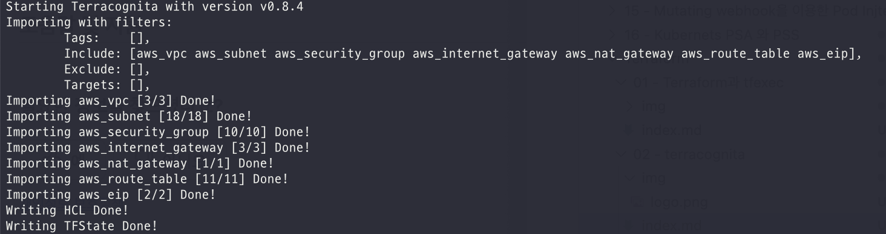
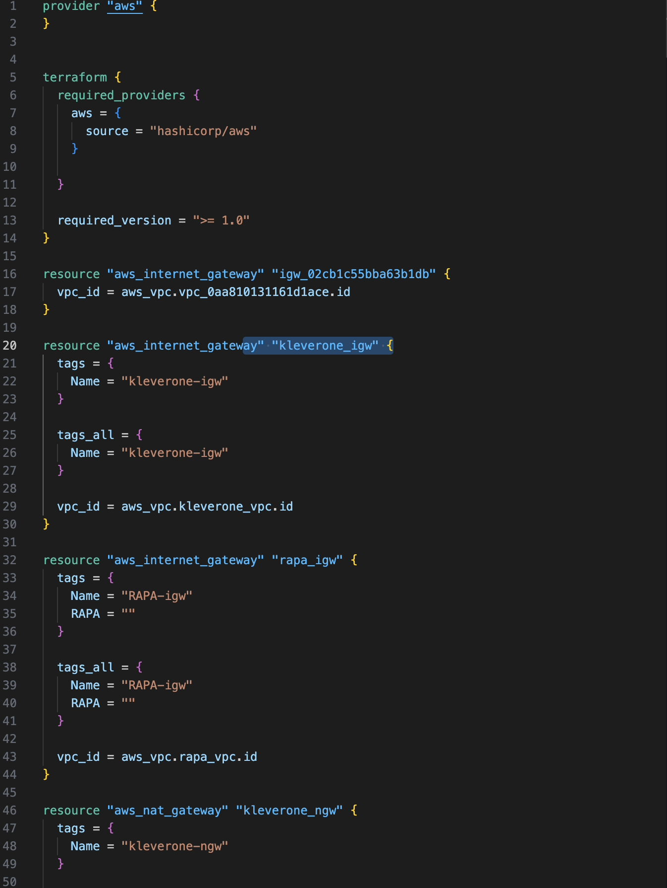

# terracognita를 이용한 tf 추출

`Terraform`은 클라우드상에서 리소스를 추적하고 프로비저닝하기에 좋은 툴이지만 기구축된 자원에 대해서는 관리가 힘들다는 단점이 있다.


이를 어느정도 해소하기 위해서는 기생성된 자원에 대해서 tf파일을 별도로 생성 후 import를 해야하지만 이를 도와주는 도구가 있다.


바로 [terracognita](https://github.com/cycloidio/terracognita?tab=readme-ov-file) 이다.


`reverse Terraform`라고도 불리며 sdk등을 이용하여 Terraform파일인 tf파일을 생성해준다.

# 설치

설치는 하기에 기술한대로 설치할 수 있다.

바이너리
```
curl -L https://github.com/cycloidio/terracognita/releases/latest/download/terracognita-linux-amd64.tar.gz -o terracognita-linux-amd64.tar.gz
tar -xf terracognita-linux-amd64.tar.gz
chmod u+x terracognita-linux-amd64
sudo mv terracognita-linux-amd64 /usr/local/bin/terracognita
```

<br>

go
```
git clone https://github.com/cycloidio/terracognita
cd terracognita
make install
```


<br>

macos
```
brew install terracognita
```


# 사용법

`terracognita`의 사용법은 크게 어렵지 않다.

<br>

하기와 같이 사용할 수 있다.

```
terracognita [TERRAFORM_PROVIDER] [--flags]
```

<br>


`aws`의 특정 리소스를 추출한다면 아래와 같이 사용할 수 있다.

```
terracognita aws \
  --aws-access-key "$AWS_ACCESS_KEY_ID" \
  --aws-secret-access-key "$AWS_SECRET_ACCESS_KEY" \
  --aws-default-region "ap-northeast-2" \
  --hcl ./test/output.tf \
  --tfstate ./test/output.tfstate \
  --include aws_vpc,aws_subnet,aws_security_group,aws_internet_gateway,aws_nat_gateway,aws_route_table,aws_eip \
```

<br>

이를 실행한다면 아래와 같다.




굉장히 간단하게 tf파일과 tfstate를 얻을 수 있다.

<br>

아래는 위 명령어를 통해 얻은 tf파일의 일부이다.



만약 제공되는 리소스가 필요하다면 아래 명령어를 통해 제공되는 리소스 리스트를 얻을 수 있다.

> terracognita aws resources


