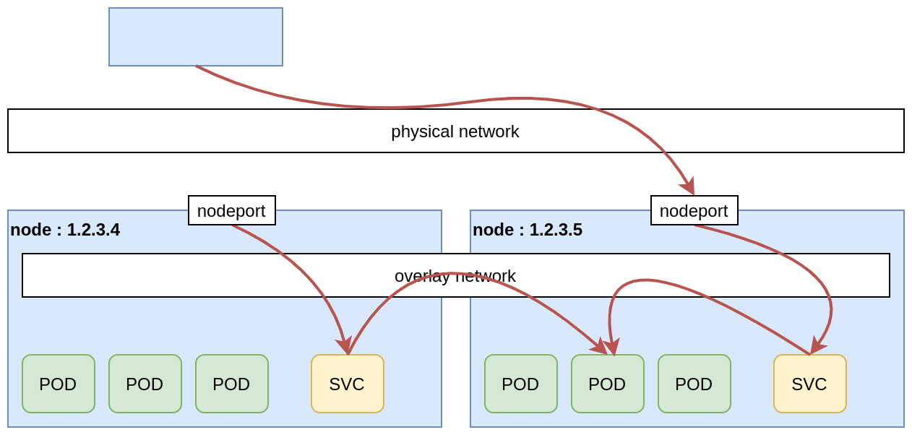
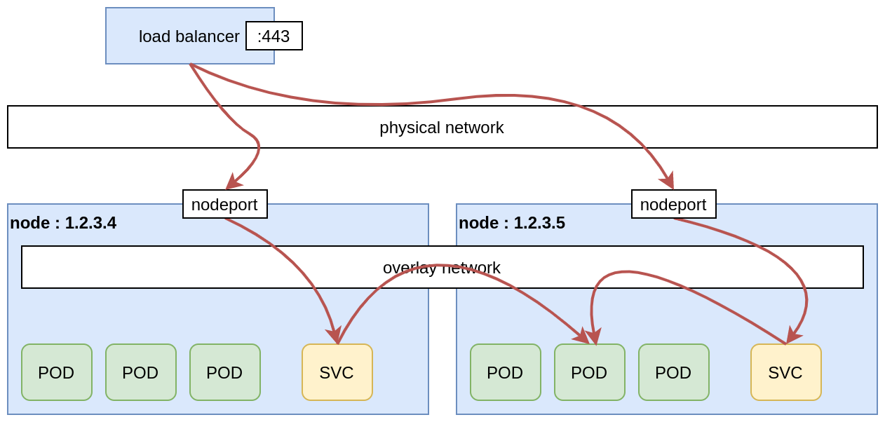
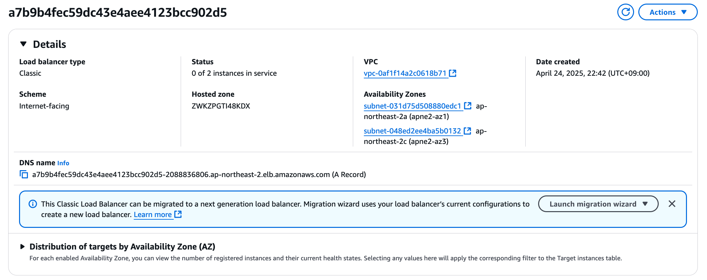

# aws-load-balancer-controller

쿠버네티스에서 애플리케이션 서빙을 위해서는 두가지의 리소스를 사용한다.

바로 `Service`와 `Ingress`이다.

`Service`의 경우, `Pod`을 논리적인 그룹으로 묶고 이를 네트워크(k-proxy등)에 노출시키는 가상의 컴포넌트이다.

`Pod`의 경우 특정 상태를 유지하기 위해 사용하는 일회성 자원이기에 반영속성인(ephemeral)한 `Service`를 이용한다고 할 수 있다.

즉, `Pod`이 통신할 수 있도록 IP를 부여해주는 역할을 수행한다.

서비스 타입은 크게 4가지로 나누어진다

* ClusterIP -> 클러스터 내부에서만 접근 가능한 IP
* NodePort -> Node의 port로 Port-fowarding
* LoadBalancer -> Cluster IP와 NodePort의 통합
* ExternalName -> kube-dns 컴포넌트로 DNS를 이용

 

여기서 살펴볼 것은 `LoadBalancer`타입이다.

`LoadBalancer`를 간단하게 설명하자면 NodePort와 ClusterIP의 기능을 합쳤다고 할 수 있다.

이는 CSP와 같은 환경을 고려하여 설계되었으며, 어떤 `NodePort`를 통하더라도 `Overlay` 네트워크를 통해 `Pod`으로 라우팅되도록 구성된 것이다.

 출처:  https://cylab.be/blog/154/exposing-a-kubernetes-application-service-hostport-nodeport-loadbalancer-or-ingresscontroller 

 

이를 간단하게 서술하면 하기와 같다.

1. 물리 네트워크(외부 로드밸런서) -> NodePort

2. NodePort -> Service

 

앞에 LB를 붙인다면 아래 사진과 같다.

이를 이용한다면 CSP 입장에서는 LB구현이 쉬워진다.

사용자가 `LoadBalancer` 타입으로 서비스를 생성하였다면 모든 Node에 특정 NodePort를 Target으로 넣으면 손쉽게 구현된다.

대부분의 CSP에서는  `LoadBalancer` 타입으로 서비스를 생성시  아래와 같이 외부 네트워크에서 트래픽을 쿠버네티스로 전달하는 로드밸런서를 확인할 수 있다.

아래의 경우는 아무런 어노테이션을 부여하지 않았기에 `AWS Classic Load Balancer`를 생성하였지만 옵션에 따라 `AWS Network Load Balancer`또한 생성이 가능하다.

# AWS Load Balancer와 Kubernets Load Balancer 

기본적으로`Load Balancer`의 구성은 서비스의 메니페스트 즉, 어노테이션을 통해 관리된다.

특징으로는 ALB(AWS Load Balancer)의 경우 VPC CNI 플러그인을 통해 EC2 IP 혹은 Fargate IP도 Target 그룹으로 지정이 가능하다.

다만 하이브리드 노드의 경우에는 IP 대상으로만 로드 밸런싱이 가능하다.

# aws-load-balancer-controller
----

NCP의 NKS의 경우, 사용자가 LoadBalancer` 타입으로 서비스를 생성하면 실제로 LB가 자동적으로 생성된다.

AWS의 경우